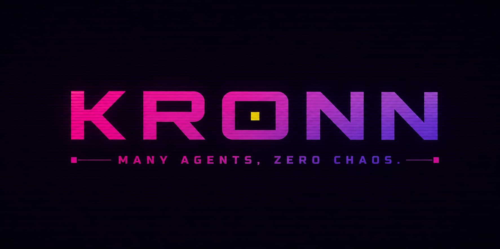
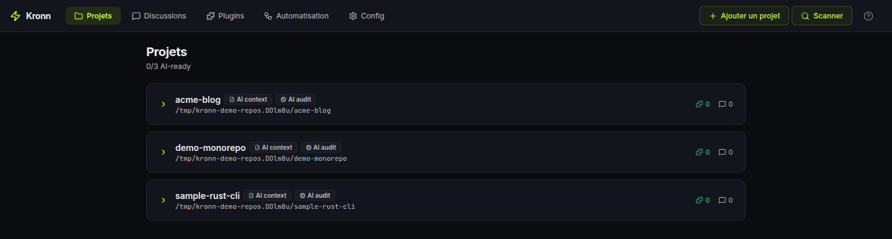
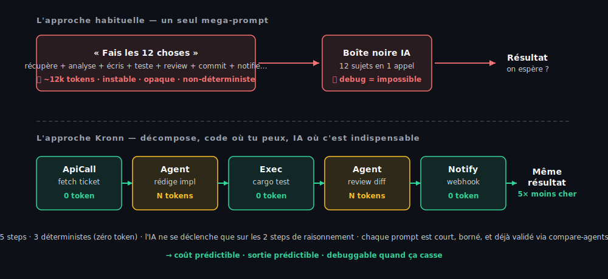
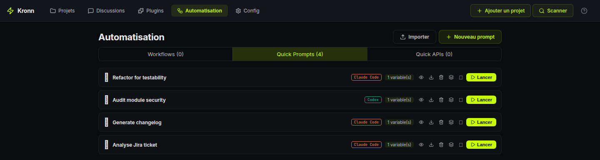
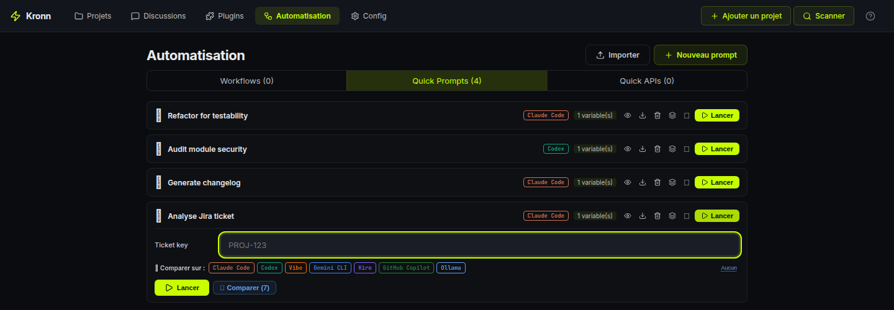
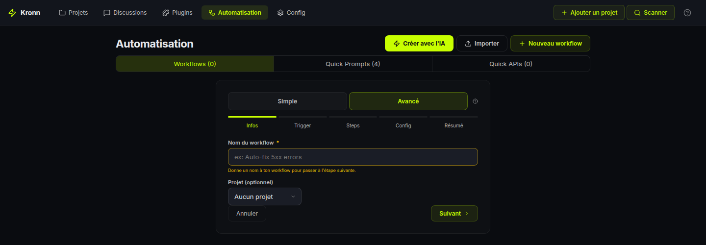
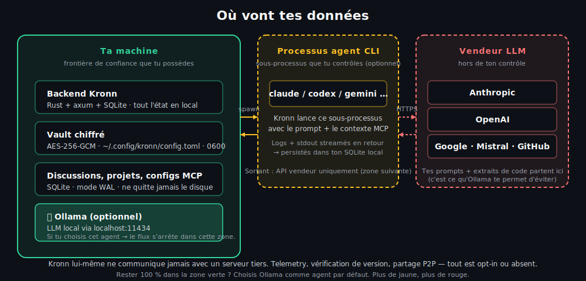

<p align="center">
  
</p>

<p align="center">
  <a href="https://docroms.github.io/Kronn/"></a>
  &nbsp;
  <a href="README.md"></a>
</p>

<p align="center">
  <a href="https://github.com/DocRoms/Kronn/releases/latest"></a>
  <a href="LICENSE"></a>
  <a href="https://github.com/DocRoms/Kronn/actions"></a>
</p>

<p align="center">
  <a href="https://github.com/DocRoms/Kronn/stargazers"></a>
  <a href="https://github.com/DocRoms/Kronn/commits/main"></a>
</p>

<p align="center">
  
</p>

**Pilote Claude Code, Codex, Gemini, Ollama (100 % local) et 3 autres CLI d'agents IA depuis un seul dashboard self-hosted, avec des MCP partagés, des secrets chiffrés et des workflows répétables.**

**Prompts plus petits, code déterministe quand c'est possible : moins d'hallucinations, facture tokens divisée, écoconception par conception.**

> **Statut : 0.8.12 (en développement — dernière release stable : 0.8.11).** Fonctionnel mais pré-1.0. Les versions mineures peuvent introduire des breaking changes ; les patch versions sont safe.
> **Licence : AGPL-3.0.** Utiliser Kronn localement pour développer *ton propre* produit ne déclenche pas le copyleft ; il ne s'applique que si tu redistribues une version modifiée à d'autres. Voir [Notes sur la licence](#notes-sur-la-licence-agpl-3-0).

## Sommaire

- [Le pitch en 60 secondes](#le-pitch-en-60-secondes)
- [L'approche Kronn : de l'ingénierie, pas de l'incantation](#lapproche-kronn--de-lingénierie-pas-de-lincantation)
- [Démarrage rapide](#démarrage-rapide)
- [Ce que tu peux en faire](#ce-que-tu-peux-en-faire)
- [Concepts clés](#concepts-clés)
- [Quand Kronn est utile, et quand il ne l'est pas](#quand-kronn-est-utile-et-quand-il-ne-lest-pas)
- [Confiance](#confiance)
- [Liens](#liens)

---

## Le pitch en 60 secondes

Si tu as déjà :

- **Jonglé entre Claude Code + Codex + Copilot dans cinq terminaux** avec sept fichiers MCP qui dérivent *(MCP = Model Context Protocol, le standard ouvert utilisé par les agents pour se brancher sur des outils et des sources de données)*, Kronn les unifie dans **un seul onglet** avec MCPs, secrets et contexte projet partagés.
- **Collé le même prompt 30 fois sur des tickets/fichiers**, sauvegarde-le une seule fois en Quick Prompt, propage-le en Batch sur ton tracker. Exemple réel : **30 PR rédigées le temps d'un café, verrouillées derrière une approbation humaine avant le merge.**
- **Regardé un mega-prompt de 500 lignes halluciner à moitié 12 tâches différentes**. Kronn te laisse décomposer : du code déterministe quand c'est mécanique (API, exec, webhook, zéro token), des petits prompts IA focused uniquement là où le raisonnement est indispensable, chacun validé via compare-agents avant d'être shippé.
- **Voulu de l'IA sur ton code mais PAS ton code chez Anthropic**. Branche [Ollama](https://ollama.com), lance Llama / Gemma / Qwen localement. **0 € de tokens, 0 fuite de données**, même UI.

Kronn est un **control plane self-hosted pour agents IA de code** : Claude Code, Codex, Vibe, Gemini CLI, Kiro, GitHub Copilot CLI, et Ollama. Backend en Rust, frontend en React, secrets dans un vault chiffré sur ta machine.

> **Tu te contentes d'un seul CLI aujourd'hui ?** Kronn devient utile dès que tu ajoutes un deuxième agent ou que tu veux rejouer un prompt sur N fichiers. C'est la couche au-dessus de ton assistant unique.

---

## L'approche Kronn : de l'ingénierie, pas de l'incantation

La plupart des workflows "AI-powered" reposent sur UN mega-prompt qui demande à l'agent de faire 12 choses à la fois.
Cher en tokens. Instable en sortie. Opaque quand ça casse. Non-déterministe par nature.

Kronn inverse ça :

1. **Décompose** ta tâche en un workflow de steps petits et bornés.
2. **Utilise du code quand le code suffit** : `ApiCall` pour fetch, `JsonData` pour les fixtures, `Exec` pour le shell, `Notify` pour les webhooks, `BatchApiCall` pour propager N appels HTTP en parallèle. **Zéro token, déterministe, debuggable.**
3. **N'utilise l'IA QUE sur le step de raisonnement**, avec un prompt court et ciblé, naturellement plus fiable qu'un prompt qui jongle 12 préoccupations. Besoin de lancer ce petit prompt sur N items ? Utilise `BatchQuickPrompt` pour le propager en discussions parallèles.
4. **Valide chaque prompt IA via compare-agents.** Si Claude, Codex et Gemini convergent sur la même réponse → ship. Si ça diverge → ton prompt est ambigu, fix-le *avant* qu'il te coûte 30× sur un batch.
5. **Écoconception par conception** : les tokens ne brûlent que là où ils méritent leur coût. Moins de dépense, moins de carbone, sortie plus prédictible.

<p align="center">
  
</p>

C'est ce qui rend Kronn différent de Cursor (un prompt, un agent) et de LangGraph (Python-only, pas d'agents CLI, pas de compare).

---

## Démarrage rapide

**Prérequis :** au moins un agent installé localement (Claude Code, Codex, Vibe, Kiro, Gemini CLI, GitHub Copilot CLI) ou [Ollama](https://ollama.com) pour des modèles 100 % locaux. Kronn pilote le runtime que tu utilises déjà ; il n'embarque pas son propre LLM. Le wizard d'installation auto-détecte ce qui est sur ton `$PATH`, avec un fallback `npx` pour les agents distribués via npm.

### Application Desktop : recommandée pour un usage solo

Télécharge l'installeur pour ton OS depuis [Releases](https://github.com/DocRoms/Kronn/releases/latest). Pas de Docker, pas de runtime supplémentaire. Étapes par OS dans [docs/install.md](docs/install.md).

<details>
<summary><strong>Self-hosted (équipe partagée, always-on, serveur headless)</strong></summary>

Requiert Docker + Docker Compose. Sur Windows, WSL2 (Docker Engine dans WSL fonctionne, Docker Desktop optionnel).

```bash
git clone --branch 0.8.11 --depth 1 https://github.com/DocRoms/Kronn.git   # dernière release stable
cd Kronn
./kronn start
# → http://localhost:3140
```

</details>

Dans les deux modes, le wizard scanne tes repos et te guide pour les clés API.

**Jour 1 : premières 5 minutes**

1. **Ouvre un projet** que le wizard a trouvé (ou ajoute-en un). Kronn scanne les `.mcp.json` existants et adopte les MCPs automatiquement.
2. **Démarre une discussion**, choisis un agent, pose ta question. L'agent tourne en local avec tes MCPs injectés, pas de config manuelle par CLI.
3. **Sauvegarde un prompt utile** en Quick Prompt avec des `{{variables}}`. One-shot ou fan-out (Batch) sur une liste d'items.

Quand tu veux orchestrer (multi-step, conditionnel, planifié, gaté), passe à un [Workflow](docs/architecture/overview.md#workflow-engine).

---

## Ce que tu peux en faire

Quatre flows qui répondent à de vrais besoins. Chacun est un use case primaire, choisis celui qui correspond à ta journée.

### 1. Batcher un Quick Prompt sur N tickets

Sauvegarde `Analyse le ticket {{ticket}} et propose une PR` en Quick Prompt. Colle 30 clés Jira (ou récupère-les d'un step tracker). Kronn lance une discussion par item, en parallèle, chacune avec son propre git worktree si tu veux l'isolation. Tu les passes toutes derrière un Gate humain, rien ne merge sans toi.

> **Run concret** (chiffres réels d'un batch de 30 tickets sur Claude Sonnet, ~4k tokens d'entrée + 6k de sortie par ticket, avec le prompt caching activé) : **~3 $ de coût API, ~3 min de temps total, 0 copier-coller manuel.** Même batch sur Ollama avec `gemma3:27b` en local : **0 $, ~12 min** selon ton matériel.

<p align="center">
  
</p>

### 2. Valider des petits prompts IA via compare-agents 🤝

Avant d'intégrer un prompt dans un workflow, clique *Comparer sur les N agents installés* sur n'importe quel Quick Prompt. Kronn lance une discussion par agent (Claude, Codex, Gemini, Vibe, Ollama…), même prompt rendu, résultats qui streament en parallèle.

S'ils convergent tous sur la même réponse → ton prompt est solide, déploie-le dans un Batch ou un step de Workflow. S'ils divergent → ton prompt est ambigu, corrige-le *avant* que ça te coûte 30× sur un batch.

**Compare-agents = le garde-fou QA du prompt engineering.** Pas cher à lancer une fois, économise une fortune si ça attrape un mauvais prompt avant qu'il parte en prod.

<p align="center">
  
</p>

### 3. 100 % local avec Ollama

Lance Llama 3, Gemma, Qwen, Codestral sur ta machine via Ollama, traité comme un agent à part entière. Mêmes Discussions / Quick Prompts / Workflows, Kronn route juste les appels vers `http://localhost:11434/v1/` au lieu du cloud. Choisis ton modèle par défaut depuis Settings. **0 € de tokens, 0 ligne de code qui quitte ton laptop.**


### 4. Ne brûle des tokens QUE là où ils méritent leur coût

Un vrai workflow Auto-Dev dans Kronn ressemble à ça :

- `ApiCall` récupère le ticket Jira → **0 token**
- `Agent` (Claude, prompt court et ciblé validé via compare-agents) rédige l'implémentation → **N tokens**, *le SEUL step où le raisonnement compte*
- `Exec` lance `cargo test` → **0 token**
- `Agent` (petit prompt focused) review le diff contre les tests → **N tokens, borné**
- `Notify` poste le résultat sur Slack → **0 token**

5 steps, 3 déterministes. L'IA ne se déclenche que sur les 2 steps de raisonnement, chacun avec un prompt court et borné. Résultat : **coût prédictible, sortie prédictible, debuggable quand ça casse.** Voir [L'approche Kronn](#lapproche-kronn--de-lingénierie-pas-de-lincantation).

Tu construis ça via le **wizard UI** (drag-drop des types de step, autocomplétion sur les références agent/MCP/QP) ou un fichier `WORKFLOW.md` écrit à la main (compatible Symphony), aucun DSL à apprendre, les deux modes interop.

Le moteur de workflow supporte **8 types de steps** au total : `Agent`, `ApiCall`, `BatchApiCall`, `BatchQuickPrompt`, `JsonData`, `Notify`, `Gate` (approbation humaine), `Exec` (shell, allowlist-gated). Référence complète dans [docs/architecture/overview.md](docs/architecture/overview.md#workflow-engine).

<p align="center">
  
</p>

### 5. Audite ta codebase avec une IA qui n'oublie pas

La plupart des « demande à l'IA ce qu'elle pense de mon repo » repartent de zéro à chaque conversation. Kronn inverse ça : la première fois que tu onboardes un projet, une passe d'audit lit ton code + tes configs et écrit une arborescence `docs/` structurée qui vit dans le repo.

- `docs/AGENTS.md` : stack, tâches courantes, fichiers source-of-truth, règles de placement de code
- `docs/repo-map.md` : arbre des dossiers + entrypoints clés
- `docs/coding-rules.md` : linters, formatters, conventions effectivement observées
- `docs/testing-quality.md` : couverture, composants sans test, commandes smoke
- `docs/architecture/overview.md` : patterns, data flow, **table des migrations legacy**
- `docs/operations/debug-operations.md` : commandes + troubleshooting
- `docs/operations/mcp-servers.md` : capabilities par MCP découvertes via introspection
- `docs/glossary.md` : glossaire domaine construit depuis ton code
- `docs/tech-debt/*.md` + `docs/inconsistencies-tech-debt.md` : un fichier de détail par finding, taggé par sévérité, tous liés depuis une table d'index unique.

Les inconnus sont marqués `<!-- TODO: verify -->` ou `<!-- TODO: ask user -->`. Une phase de validation te les fait parcourir interactivement, le statut projet passe `NoTemplate → TemplateInstalled → Bootstrapped → Audited → Validated`.

L'arborescence entière est injectée comme contexte projet dans chaque Discussion, Quick Prompt et Workflow sur ce projet, donc ton agent ne redémarre pas de zéro à chaque chat.

**Le drift detection est granulaire** : chaque section traque ses fichiers sources (ex. `coding-rules.md` surveille `package.json` + `tsconfig.json` + `rustfmt.toml`). Quand ces fichiers changent, la section est marquée stale et tu peux ré-auditer juste ce step. Pas besoin de relancer tout l'audit pour une seule config modifiée.

**Ce que 0.8.2 durcit (à partir d'oublis réels constatés)**

- **Checklist baseline obligatoire** : le Step 9 scanne TOUJOURS 5 catégories trop souvent oubliées (Dockerfile USER / display_errors / opcache / HEALTHCHECK, compose resource limits, CI quality gate + `StrictHostKeyChecking`, secrets dans `.env*`, a11y/CSP web). Chaque item produit une ligne explicite « verified present / verified absent / TD » — tu peux faire confiance à l'audit pour ne pas avoir détourné le regard.
- **Mémoire anti-répétition** : chaque audit lit les TDs existants comme priors et RÉUTILISE leurs IDs au lieu de churner les slugs. Un bloc YAML `audit_history` sur chaque fichier détail trace chaque passe. Un rapport de réconciliation (`_reconciliation-<date>.md`) classifie les TDs disparus en `Fixed / Stale / Missed / Uncertain` — plus rien ne disparaît silencieusement entre audits.
- **Statut à deux niveaux** : `Verified in source` (l'agent a ouvert le fichier et confirmé) vs `Inferred` (pattern match seulement). La Phase 3 de validation skip les Verified pour t'épargner le temps.
- **Types d'audit spécialisés** : à côté du Full audit canonique en 10 steps, Kronn ship des passes focalisées — `Drift`, `Security`, `Docker`, `Performance`, `Accessibility`, `Database`, `ApiDesign`, plus une escape hatch `Custom`. Chacune écrit dans son propre fichier d'index pour ne pas écraser les TDs du Full.
- **Health badge avec cluster recommendations** : chaque run est persisté dans `audit_runs` avec durée, comptage par sévérité (Critical × 12 + High × 4 + Medium × 1.5 + Low × 0.3 = score 0–100) et une liste `recommendations_json`. Quand ≥3 findings clusterisent sur une dimension (ex. 5 TDs Docker), le dashboard surface inline « Lance un audit Docker focus ».
- **Gate community standards** : si ton projet a une intent OSS (LICENSE présent OU remote sur github/gitlab/codeberg OU README mentionne « contribute »), le Step 9 flag aussi les `LICENSE`, `SECURITY.md`, `CONTRIBUTING.md`, `CODE_OF_CONDUCT.md`, templates issue/PR manquants. Les projets privés skip ce bloc entièrement.

C'est ce qui fait de Kronn une **couche de persistance de connaissance avec baselines strictes**, pas juste un lanceur de prompts.

### 6. Boucle la boucle : audit → tickets → AutoPilot → PR

L'audit n'est pas un doc qui dort dans un coin. **0.8.2 le branche à l'action.**

Quand l'IA confirme `KRONN:VALIDATION_COMPLETE` sur la discussion de validation, la page surface deux CTAs :

1. **« Marquer l'audit comme valide »** — flip le statut projet, gèle la baseline TD.
2. **« Configurer AutoPilot »** — ouvre le wizard de workflow avec le préset `ticket-to-pr` déjà appliqué ET configuré pour ton projet :
   - Tracker auto-détecté depuis ton `repo_url` (github.com → mcp-github, gitlab.com → mcp-gitlab, …)
   - Path params `{owner}/{repo}` remplis depuis le remote parsé
   - Premier step (`fetch_issue`) basculé de fixture JSON → vrai `ApiCall` sur ton tracker
   - Landing sur la **page Steps en mode Advanced** pour que tu voies la pipeline complète en 9 steps (`fetch_issue → analyze → plan_gate → implement → run_tests → review → create_pr → ready_gate → notify_done`).

Le préset 9 steps suit la discipline « désagentification » de Kronn : seuls `analyze`, `implement` et `review` brûlent des tokens agent. Le reste est mécanique (`ApiCall`, `Exec`, `Gate`, `Notify`).

**Le pattern killer que ça débloque** : tu crées une issue GitHub depuis ton mobile → le trigger Tracker d'AutoPilot la chope → le workflow rédige la PR pendant que t'es loin du clavier, en pausant sur `plan_gate` pour ton approbation et sur `ready_gate` avant le merge. *Vraie autonomie avec deux checkpoints humains.*

#### Les steps Exec survivent dans un worktree

Le step `run_tests` c'est typiquement `npm test`, `cargo test`, `composer test`, `pytest`, … — tous ont besoin des deps vendorisées qui **n'existent pas dans un worktree git frais** (pas de `node_modules`, pas de `vendor`, pas de `target`). Chaque step `Exec` a maintenant une **phase Setup** optionnelle qui tire *juste avant* la commande principale :

```
☑ Ce step tourne dans un worktree git — installer les dépendances avant
    Setup command: composer install --no-interaction --prefer-dist
                   (auto-détecté depuis composer.json — éditable)

Main command:     bin/phpunit -c phpunit.xml.dist
```

Même allowlist + même timeout. Setup échoue → main n'est PAS exécuté et tu vois les logs d'install. Setup réussit → main tourne dans le worktree préparé. Patterns courants pré-listés (composer, npm ci, pnpm, yarn, poetry, pip) — t'en choisis un, tu override si besoin.

Pour les projets dockerisés, le mismatch volume `docker-in-docker` est réglé au niveau infra (self-mount + traduction de chemins host), donc `docker compose run --rm svc <cmd>` marche depuis un worktree sans config supplémentaire.

---

## Concepts clés

### Les objets que tu crées

- **Project** : un repo git que Kronn connaît. Garde le contexte IA (`docs/AGENTS.md`) plus une arborescence d'audit structurée (`docs/glossary.md`, `docs/repo-map.md`, `docs/architecture/overview.md` et ses sœurs) qui couvre les hotspots legacy, les gaps de tests, les conventions de code et les capabilities par MCP. Chaque section a son drift detection : ré-audite uniquement ce qui est stale.
- **Discussion** : un thread de chat lié (ou non) à un projet. Mono-agent ou debate multi-agents. Stream temps réel via SSE, persisté en SQLite, isolable dans un git worktree.
- **Quick Prompt** : un template de prompt réutilisable avec `{{variables}}` et sections conditionnelles. One-shot, fan-out, ou chaîné.
- **Workflow** : un pipeline multi-step. Déclenché par cron, par un tracker (Jira / GitHub), ou manuellement. Voir [docs/architecture/overview.md](docs/architecture/overview.md#workflow-engine) pour les garanties moteur.

### Comment les agents sont façonnés

Trois couches indépendantes injectées dans le system prompt :

| Couche | Répond à | Exemple |
|---|---|---|
| **Profile** | QUI parle | « Senior backend engineer » / « Tech writer » |
| **Skill** | CE QU'il sait | « Rust ownership » / « JSONPath RFC 9535 » |
| **Directive** | COMMENT il parle | « Concis, pas d'excuses » / « Cite toujours le chemin du fichier » |

17 profiles par défaut, 25 skills par défaut, custom via Markdown + YAML dans `~/.config/kronn/`.

### Intégrations

**Plugins MCP / API / hybrides** : configure une fois avec secrets chiffrés, lié aux projets en N:N. Les MCPs se synchronisent vers le bon fichier de config par agent (`.mcp.json` pour Claude Code, `~/.codex/config.toml` pour Codex, `.gemini/settings.json` pour Gemini, etc.). Les plugins API injectent endpoints + auth dans le system prompt pour que l'agent les appelle via `Bash curl`, pas besoin d'un serveur MCP. OAuth2 client-credentials géré de manière transparente.

**N'importe quelle API REST passe.** 40+ plugins built-in (GitHub, GitLab, Jira, Stripe, Slack, Chartbeat, Adobe Analytics, AWS CloudWatch…) couvrent les cas courants, et une option **Custom API** te permet de décrire n'importe quel autre vendeur dans un formulaire libre : nom, URL de base, description, lien doc optionnel, et les champs de credentials dont l'agent a besoin. Une bulle d'aide IA pré-remplit le formulaire à partir d'un exemple curl ou d'un lien doc en un clic.

---

## Quand Kronn est utile, et quand il ne l'est pas

**Utile** si tu pilotes plusieurs CLI IA, veux **décomposer ton travail IA en workflows bornés** (PR review, audit, génération depuis specs, batch sur tickets), où les steps mécaniques sont du code déterministe et l'IA ne se déclenche que sur le raisonnement. Bonus : tout self-hosted avec tes secrets dans ton vault.

**Pas utile** pour des pipelines RAG purs, pour de l'orchestration Python in-process (LangGraph est le meilleur choix), ou des workloads qui ont besoin de multi-tenancy géré. Kronn est un **moteur de workflow mixte (CLI agents + code déterministe) sur des fichiers locaux**, pas un framework LLM Python, pas un SaaS multi-tenant.

**Vs les autres outils :**

| Outil | Pourquoi pas eux | Où Kronn comble la niche |
|---|---|---|
| **Cursor / Copilot Workspace** | Un agent, un mega-prompt, pas de workflow engine, pas de batch, pas de compare-agents | Quand tu veux passer du one-shot au pipeline répétable + auditable |
| **n8n** | Automatisation générique, pas de contexte agent, pas de MCP | Quand l'IA est un step parmi d'autres, pas l'orchestrateur |
| **Temporal** | Exécution durable à très grande échelle (niveau Uber/Stripe) avec replay + signals ; overkill pour orchestrer des CLI agents sur un laptop, pas de primitives IA | Quand tu veux le pattern workflow sans l'empreinte opérationnelle de Temporal |
| **LangGraph** | Python in-process, pas de CLI agents, pas de plumbing MCP, pas de compare | Quand tu veux orchestrer les CLI réels (Claude, Codex…) avec leurs propres caches/sessions |
| **LiteLLM** | Couche routeur API LLM, mais pas de workflow ni de CLI agents | Complémentaire : tu peux mettre LiteLLM derrière un step `Agent` Kronn |

---

## Confiance

<p align="center">
  
</p>

Self-hosted = on te doit de la précision sur où vont tes données.

- **Reste local par défaut.** Backend Rust + axum + SQLite, vault chiffré au repos (AES-256-GCM). La master key est un secret aléatoire de 32 octets généré au premier lancement, stocké dans `~/.config/kronn/config.toml` (mode `0600`, répertoire `0700` sur Unix ; ACL par utilisateur sur Windows). Protection par permissions filesystem ; pas encore d'OS keychain ni de dérivation Argon2id depuis une passphrase. Les prompts agents partent vers le vendeur CLI *que tu as choisi* (Anthropic / OpenAI / Google / Mistral / personne si tu prends Ollama). Kronn ne communique jamais avec un serveur tiers. Diagramme de flux complet dans [docs/operations/auth-and-tls.md](docs/operations/auth-and-tls.md).
- **Frontière container/hôte.** En mode Docker, on monte ton `$HOME` en read-only et tes `~/.<agent>` config dirs en read-write : exactement ce qu'il faut pour piloter les agents, rien de plus. Liste détaillée des mounts dans [docs/install.md](docs/install.md).
- **Hardening.** Garde-fous SSRF sur les plugins API (RFC1918, IPv6 ULA, détection DNS-rebind). Step `Exec` verrouillé par allowlist par workflow, pas de `sh -c`, argv literals uniquement. Bypass d'auth + plan migration TLS dans [docs/operations/auth-and-tls.md](docs/operations/auth-and-tls.md).
- **Bus factor.** Un seul mainteneur principal aujourd'hui, AGPL-3.0, tous les docs de design + contribution dans [docs/AGENTS.md](docs/AGENTS.md). Les forks sont bienvenus ; le code est structuré pour qu'on remplace un agent backend sans toucher au moteur.

### Notes sur la licence (AGPL-3.0)

En pratique, pour 99 % des usages :

- **Utiliser Kronn en local pour développer ton propre produit ?** L'AGPL ne s'applique pas : tu ne distribues pas Kronn.
- **Faire tourner Kronn en SaaS pour d'autres utilisateurs ?** L'AGPL s'applique : ton Kronn modifié doit être open-sourcé aussi.
- **Forker Kronn pour usage interne en entreprise ?** L'AGPL ne se déclenche pas (pas de distribution hors de l'org).

Texte complet dans [LICENSE](LICENSE). Si ton équipe légale veut de la nuance, discussions dual-licensing ouvertes.

---

## Liens

- [Site web](https://docroms.github.io/Kronn/) : le site de présentation de Kronn (FR / EN / ES)
- [docs/install.md](docs/install.md) : install par OS, Docker, WSL2, Tauri desktop
- [docs/architecture/overview.md](docs/architecture/overview.md) : topologie backend/frontend, référence du moteur workflow
- [docs/operations/auth-and-tls.md](docs/operations/auth-and-tls.md) : auth, TLS, data flow
- [docs/AGENTS.md](docs/AGENTS.md) : référence complète pour contributeurs (humains et agents IA)
- [CONTRIBUTING.md](CONTRIBUTING.md) : DCO, règles de code, politique de tests
- [CHANGELOG.md](CHANGELOG.md) : notes de release
- [LICENSE](LICENSE) : AGPL-3.0
