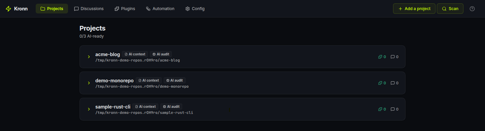
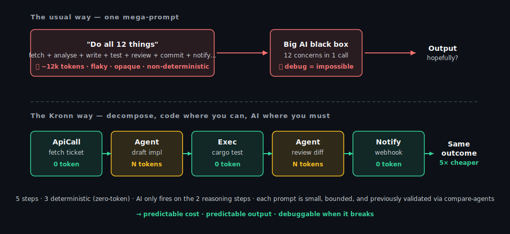
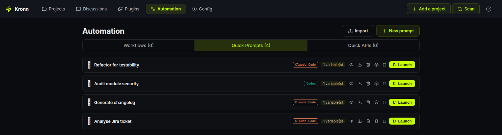
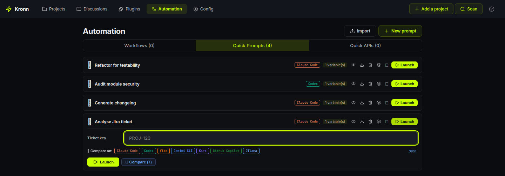
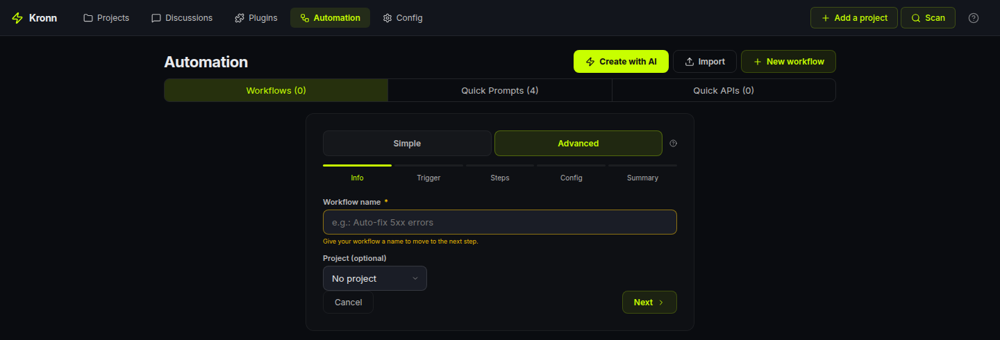
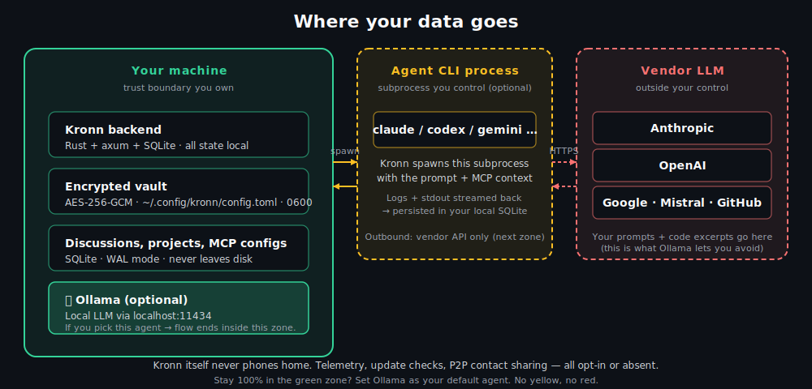

<p align="center">
  
</p>

<p align="center">
  <a href="https://docroms.github.io/Kronn/"></a>
  &nbsp;
  <a href="README.fr.md"></a>
</p>

<p align="center">
  <a href="https://github.com/DocRoms/Kronn/releases/latest"></a>
  <a href="LICENSE"></a>
  <a href="https://github.com/DocRoms/Kronn/actions"></a>
</p>

<p align="center">
  <a href="https://github.com/DocRoms/Kronn/stargazers"></a>
  <a href="https://github.com/DocRoms/Kronn/commits/main"></a>
</p>

<p align="center">
  
</p>

**Run Claude Code, Codex, Gemini, Ollama (100% local) and 3 other AI coding CLIs from one self-hosted dashboard, with shared MCPs, secrets, and repeatable workflows.**

**Smaller prompts, more code where code is enough: fewer hallucinations, lower token bill, eco-design by default.**

> **Status: 0.8.8.** Functional but pre-1.0. Breaking changes happen between minor versions; patch versions are safe.
> **License: AGPL-3.0.** Using Kronn locally to build *your own* product is fine; the copyleft only kicks in if you distribute a modified Kronn to others. See [License notes](#license-notes-agpl-3-0).

## Contents

- [60-second pitch](#60-second-pitch)
- [The Kronn way: engineering, not prompting](#the-kronn-way-engineering-not-prompting)
- [Quick start](#quick-start)
- [What you can do](#what-you-can-do)
- [Core concepts](#core-concepts)
- [When Kronn fits, and when it doesn't](#when-kronn-fits-and-when-it-doesnt)
- [Trust](#trust)
- [Links](#links)

---

## 60-second pitch

If you've ever:

- **Juggled Claude Code + Codex + Copilot in five terminals** with seven MCP config files going out of sync *(MCP = Model Context Protocol, the open standard agents use to plug into tools and data sources)*, Kronn unifies them in **one tab** with shared MCPs, secrets, and project context.
- **Pasted the same prompt 30 times across tickets/files**, save it once as a Quick Prompt, fan it out as a Batch over your tracker. Real-world example: **30 PR drafts produced over coffee, gated for human approval before they land.**
- **Watched a 500-line mega-prompt half-hallucinate 12 different tasks**. Kronn lets you decompose: deterministic code where it's mechanical (API, exec, webhooks, zero tokens), small focused AI prompts only where reasoning matters, each one validated via compare-agents before it ships.
- **Wanted AI on your code but NOT your code on Anthropic**. Plug [Ollama](https://ollama.com), run Llama / Gemma / Qwen locally. **$0 API cost, $0 data leak**, same UI.

Kronn is a **self-hosted control plane for AI coding agents**: Claude Code, Codex, Vibe, Gemini CLI, Kiro, GitHub Copilot CLI, and Ollama. Backend in Rust, frontend in React, secrets in an encrypted vault on your machine.

> **Already happy with one CLI?** Kronn pays off the moment you add a second agent or want to replay a prompt across N files. It's the layer above your single assistant.

---

## The Kronn way: engineering, not prompting

Most "AI-powered" workflows rely on one mega-prompt asking the agent to do 12 things at once.
Expensive in tokens. Flaky in output. Opaque when it breaks. Non-deterministic by nature.

Kronn flips that:

1. **Decompose** your task into a workflow of small, bounded steps.
2. **Use code where code is enough**: `ApiCall` to fetch, `JsonData` for fixtures, `Exec` for shell, `Notify` for webhooks, `BatchApiCall` to fan out N HTTP calls in parallel. **Zero tokens, deterministic, debuggable.**
3. **Use AI only on the reasoning step**, with a small focused prompt, naturally more reliable than a prompt juggling 12 concerns. Need to run that small prompt across N items? Use `BatchQuickPrompt` to fan it out in parallel discussions.
4. **Validate each AI prompt via compare-agents.** If Claude, Codex and Gemini all converge on the same answer → ship it. If they diverge → your prompt is ambiguous, fix it *before* it costs you 30× in a batch.
5. **Eco-design built-in**: tokens only burn where they actually earn their cost. Less spend, less carbon, more predictable output.

<p align="center">
  
</p>

This is what makes Kronn different from Cursor (one prompt, one agent) and from LangGraph (Python-only, no CLI agents, no compare).

---

## Quick start

**Prerequisite:** at least one agent installed locally (Claude Code, Codex, Vibe, Kiro, Gemini CLI, GitHub Copilot CLI) or [Ollama](https://ollama.com) for fully-local models. Kronn drives the runtime you already use; it does not ship its own LLM. The setup wizard auto-detects what's on your `$PATH` with an `npx` runtime fallback for npm-published agents.

### Desktop app: recommended for solo use

Download the installer for your OS from [Releases](https://github.com/DocRoms/Kronn/releases/latest). No Docker, no extra runtime. Per-OS steps in [docs/install.md](docs/install.md).

<details>
<summary><strong>Self-hosted (team-shared, always-on, headless server)</strong></summary>

Requires Docker + Docker Compose. On Windows, WSL2 (Docker Engine inside WSL works, Docker Desktop optional).

```bash
git clone https://github.com/DocRoms/Kronn.git
cd Kronn
./kronn start
# → http://localhost:3140
```

</details>

In both modes the setup wizard scans your repos and walks you through API keys.

**Day 1: first 5 minutes**

1. **Open a project** the wizard found (or add one). Kronn scans existing `.mcp.json` files and adopts MCPs automatically.
2. **Start a discussion**, pick an agent, ask something. The agent runs locally with your MCPs injected, no manual config per CLI.
3. **Save a useful prompt** as a Quick Prompt with `{{variables}}`. One-shot or fan-out (Batch) over a list of items.

When you want orchestration (multi-step, conditional, scheduled, gated), graduate to a [Workflow](docs/architecture/overview.md#workflow-engine).

---

## What you can do

Four flows that scratch real itches. Each one is a primary use case, pick whichever maps to your day.

### 1. Batch a Quick Prompt over N tickets

Save `Analyse {{ticket}} and draft a PR` as a Quick Prompt. Paste 30 Jira keys (or pull them from a tracker step). Kronn fans out one discussion per item, in parallel, each with its own git worktree if you want isolation. Land them all behind a single human-approval Gate so nothing merges without you.

> **Concrete run** (real numbers from a 30-ticket batch on Claude Sonnet, ~4k input + 6k output tokens per ticket, with prompt caching on): **~$3 of API spend, ~3 min wall time, 0 manual copy-paste.** Same batch on Ollama with `gemma3:27b` running locally: **$0, ~12 min wall time** depending on your hardware.

<p align="center">
  
</p>

### 2. Validate small AI prompts via compare-agents 🤝

Before you wire a prompt into a workflow, click *Compare across N installed agents* on any Quick Prompt. Kronn spawns one discussion per agent (Claude, Codex, Gemini, Vibe, Ollama…), same rendered prompt, results streaming live in parallel.

If they all converge on the same answer → your prompt is solid, ship it into a Batch or a Workflow step. If they diverge → your prompt is ambiguous, fix it *before* it costs you 30× on a batch run.

**Compare-agents = the QA gate of prompt engineering.** Cheap to run once, saves a fortune if it catches a bad prompt before it enters production.

<p align="center">
  
</p>

### 3. Stay 100% local with Ollama

Run Llama 3, Gemma, Qwen, Codestral on your machine via Ollama as a first-class agent. Same Discussions / Quick Prompts / Workflows surface, Kronn just routes the calls to `http://localhost:11434/v1/` instead of the cloud. Pick your default model right from Settings. **Zero token bill, zero code leaving your laptop.**


### 4. Burn tokens only where they earn their cost

A real Auto-Dev workflow in Kronn looks like:

- `ApiCall` fetches the Jira ticket → **0 tokens**
- `Agent` (Claude, small focused prompt validated via compare-agents) drafts the implementation → **N tokens**, *the only step where reasoning matters*
- `Exec` runs `cargo test` → **0 tokens**
- `Agent` (small focused prompt) reviews the diff against the tests → **N tokens, bounded**
- `Notify` posts the result to Slack → **0 tokens**

5 steps, 3 deterministic. AI fires only on the 2 reasoning steps, each with a small bounded prompt. Result: **predictable cost, predictable output, debuggable when it breaks.** See [The Kronn way](#the-kronn-way-engineering-not-prompting).

You build this via the **wizard UI** (drag-drop step types, autocomplete on agent/MCP/QP references) or a hand-written `WORKFLOW.md` file (Symphony-compatible), no DSL to learn, both modes interop.

Workflow engine supports **8 step types** total: `Agent`, `ApiCall`, `BatchApiCall`, `BatchQuickPrompt`, `JsonData`, `Notify`, `Gate` (human approval), `Exec` (shell, allowlist-gated). Full reference in [docs/architecture/overview.md](docs/architecture/overview.md#workflow-engine).

<p align="center">
  
</p>

### 5. Audit your codebase with an AI that doesn't forget

Most "ask an AI about my repo" flows restart cold every conversation. Kronn flips that: the first time you onboard a project, an audit pass reads your source + configs and writes a structured `docs/` tree that lives in the repo.

- `docs/AGENTS.md`: stack, common tasks, source-of-truth files, code-placement rules
- `docs/repo-map.md`: folder tree + key entrypoints
- `docs/coding-rules.md`: linters, formatters, conventions actually observed
- `docs/testing-quality.md`: coverage, untested components, smoke commands
- `docs/architecture/overview.md`: patterns, data flow, **legacy migrations table**
- `docs/operations/debug-operations.md`: commands + troubleshooting
- `docs/operations/mcp-servers.md`: per-MCP capabilities discovered via introspection
- `docs/glossary.md`: domain glossary built from your actual code
- `docs/tech-debt/*.md` + `docs/inconsistencies-tech-debt.md`: one detail file per finding, severity-tagged, all linked from a single index table.

Unknowns get marked `<!-- TODO: verify -->` or `<!-- TODO: ask user -->`. A validate phase walks you through them interactively, project status moving `NoTemplate → TemplateInstalled → Bootstrapped → Audited → Validated`.

The whole tree is injected as project context into every Discussion, Quick Prompt and Workflow on that project, so your agent doesn't restart from scratch every chat.

**Drift detection is granular**: each section tracks its source files (e.g. `coding-rules.md` watches `package.json` + `tsconfig.json` + `rustfmt.toml`). When those drift, the section is flagged as stale and you can re-audit just that step. No re-running the whole audit when one config changed.

**What 0.8.2 hardens (from real-world misses)**

- **Mandatory baseline checklist**: Step 9 now ALWAYS scans 5 categories that are too common to skip (Dockerfile USER / display_errors / opcache / HEALTHCHECK, compose resource limits, CI quality gate + `StrictHostKeyChecking`, `.env*` secrets, web a11y/CSP). Each item produces an explicit "verified present / verified absent / TD" line so you trust the audit didn't just look the other way.
- **Anti-repetition memory**: each audit reads existing TDs as priors and REUSES their IDs instead of churning slugs. An `audit_history` YAML block on each TD detail file tracks every pass. A reconciliation report (`_reconciliation-<date>.md`) classifies dropped TDs as `Fixed / Stale / Missed / Uncertain` so nothing silently vanishes between audits.
- **Two-tier Status**: `Verified in source` (the agent opened the file and confirmed) vs `Inferred` (pattern-matched only). Phase 3 validation skips Verified ones to save your time.
- **Specialized audit kinds**: alongside the canonical 10-step Full audit, Kronn ships focused passes — `Drift`, `Security`, `Docker`, `Performance`, `Accessibility`, `Database`, `ApiDesign`, plus a `Custom` escape hatch. Each one writes to its own index file so it doesn't clobber the Full audit's TDs.
- **Health badge with cluster recommendations**: every run is persisted in `audit_runs` with duration, severity counts (Critical × 12 + High × 4 + Medium × 1.5 + Low × 0.3 = score 0–100) and a `recommendations_json` list. When ≥3 findings cluster in one dimension (e.g. 5 Docker TDs), the dashboard surfaces "Run a focused Docker audit" inline.
- **Community-standards gate**: if your project shows OSS intent (LICENSE present OR remote on github/gitlab/codeberg OR README mentions "contribute"), Step 9 also flags missing `LICENSE`, `SECURITY.md`, `CONTRIBUTING.md`, `CODE_OF_CONDUCT.md`, issue/PR templates. Private projects skip this block entirely.

This is what makes Kronn a **knowledge-persistence layer with strict baselines**, not just a prompt launcher.

### 6. Close the loop: audit → tickets → AutoPilot → PR

The audit isn't a doc that sits in a folder. **0.8.2 wires it into action.**

When the AI confirms `KRONN:VALIDATION_COMPLETE` on the validation discussion, the page surfaces two CTAs:

1. **"Mark audit as validated"** — flips the project's status, freezes the TD baseline.
2. **"Setup AutoPilot"** — opens the workflow wizard with the `ticket-to-pr` preset already applied AND configured for your project:
   - Tracker auto-detected from your `repo_url` (github.com → mcp-github, gitlab.com → mcp-gitlab, …)
   - `{owner}/{repo}` path params filled in from the parsed remote
   - First step (`fetch_issue`) switched from JSON fixture → real `ApiCall` against your tracker
   - Land on the **Steps page in Advanced mode** so you see the full 9-step pipeline (`fetch_issue → analyze → plan_gate → implement → run_tests → review → create_pr → ready_gate → notify_done`).

The 9-step preset uses Kronn's `désagentification` discipline: only `analyze`, `implement` and `review` burn agent tokens. The rest is mechanical (`ApiCall`, `Exec`, `Gate`, `Notify`).

**The killer pattern this unlocks**: create a GitHub issue from your phone → AutoPilot's Tracker trigger picks it up → the workflow drafts the PR while you're away from the keyboard, pausing at `plan_gate` for your approval and at `ready_gate` before the PR is merged. *Real autonomy with two human checkpoints.*

#### Exec steps now survive worktree-only environments

The `run_tests` step is typically `npm test`, `cargo test`, `composer test`, `pytest`, … — all of which need vendored deps that **don't exist in a fresh git worktree** (no `node_modules`, no `vendor`, no `target`). Each `Exec` step now has an optional **Setup phase** that fires *immediately before* the main command:

```
☑ This step runs in a git worktree — install dependencies first
    Setup command: composer install --no-interaction --prefer-dist
                   (auto-detected from composer.json — edit if needed)

Main command:     bin/phpunit -c phpunit.xml.dist
```

Same allowlist + same timeout. Setup fails → main is NOT executed and you see the install logs. Setup succeeds → main runs in the prepared worktree. Common patterns are pre-listed (composer, npm ci, pnpm, yarn, poetry, pip) — pick one, override if needed.

For dockerized projects, the `docker-in-docker` volume mismatch is solved at the infra layer (self-mount + host-path translation), so `docker compose run --rm svc <cmd>` works from a worktree without any extra config.

### 7. Catch hallucinations before they spread (0.8.7)

AI agents confidently assert file paths that don't exist, functions they invented, versions that aren't yours. When one of those lies gets persisted into `docs/AGENTS.md`, every future agent inherits it as "established truth". **0.8.7 ships a two-tier guard that runs on every agent reply.**

Three modes, defaulting to `warn`, picked in **Settings → Sourcing &amp; Anti-hallucination** (or `config.toml`) :

- **`off`** — no directive, no checking. The pre-0.8.7 behaviour.
- **`warn` (default)** — each agent receives a sourcing directive : *"cite a `file:line`, URL, or `user-confirmed` for every non-trivial claim; if you can't, say so plainly and verify before asserting."* Kronn then mechanically inspects each `[src: …]` citation the agent emits — path-jailed to the project root (no FS escape), checks the file exists and the line range is in bounds. A non-blocking per-message pill surfaces problems : **red** for fabricated citations (the cited file/line does not exist, or the source type is `training-data` = model's prior knowledge, auto-rejected), **amber** for confident claims left without any anchor. Clicking the pill opens a detail panel listing the bad citations.
- **`enforce` (preview · 0.8.8)** — same as warn today ; in 0.8.8 will refuse writes to `AGENTS.md curated="ai"` sections whose citations don't resolve.

**Honest by design** : `verified` means the citation *exists*, not that the claim is *true* (catching "real but irrelevant" citations is the job of a future LLM-judge layer). The pill is non-blocking — it's a signal you decide to act on, not a hard gate. Language-agnostic + compression-proof + ungameable : you can't fabricate a file or line number that actually exists in your repo.

The full convention is an open spec (`backend/docs/conventions/agents-md-format-v1.md`, served on `/api/conventions/agents-md-format-v1` and linked from the Settings section) — anyone can emit Kronn-compatible documentation with or without Kronn.

---

## Core concepts

### Objects you create

- **Project**: a git repo Kronn knows about. Tracks AI context (`docs/AGENTS.md`) plus a structured audit tree (`docs/glossary.md`, `docs/repo-map.md`, `docs/architecture/overview.md` and friends) covering legacy hotspots, test gaps, coding conventions and per-MCP capabilities. Each section has drift detection: re-audit only what's stale.
- **Discussion**: a chat thread bound (or not) to a project. Streams in real-time via SSE, persisted in SQLite, optionally isolated in a git worktree. Three flavours: **(a)** single agent (default), **(b)** multi-agent debate (configurable rounds), **(c)** **cross-agent room (0.8.6)** — invite N CLIs (Claude Code, Codex, Gemini, Kiro, Vibe…) into the same discussion via a one-click `[+ Inviter]` button, each agent talks via MCP tools (`disc_append`, `disc_wait_for_peer`), no human messenger needed. Validated live on a 3-agent roleplay session.
- **Quick Prompt**: reusable prompt template with `{{variables}}` and conditional sections. One-shot, fan-out, or chained.
- **Workflow**: a multi-step pipeline. Triggered by cron, by a tracker (Jira / GitHub), or manually. See [docs/architecture/overview.md](docs/architecture/overview.md#workflow-engine) for the engine guarantees.

### How agents are shaped

Three independent layers injected into the agent's system prompt:

| Layer | Answers | Example |
|---|---|---|
| **Profile** | WHO is talking | "Senior backend engineer" / "Tech writer" |
| **Skill** | WHAT it knows | "Rust ownership" / "JSONPath RFC 9535" |
| **Directive** | HOW it talks | "Concise, no apologies" / "Always reference the file path" |

17 default profiles, 25 default skills, custom ones via Markdown + YAML in `~/.config/kronn/`.

### Integrations

**MCP / API / hybrid plugins**: configure once with encrypted secrets, link to projects N:N. MCPs sync to the right config file per agent (`.mcp.json` for Claude Code, `~/.codex/config.toml` for Codex, `.gemini/settings.json` for Gemini, etc.). API plugins inject endpoints + auth into the system prompt so the agent calls them via `Bash curl`, no MCP server needed. OAuth2 client-credentials handled transparently.

**Any REST API works**. 40+ built-in plugins (GitHub, GitLab, Jira, Stripe, Slack, Chartbeat, Adobe Analytics, AWS CloudWatch…) cover the common cases, and a **Custom API** option lets you describe any other vendor in a freeform form: name, base URL, description, optional docs link, and the credential fields the agent needs. An AI helper bubble pre-fills the form from a curl example or a docs URL in one click.

---

## When Kronn fits, and when it doesn't

**Fits** if you run multiple AI CLIs, want to **decompose AI work into bounded workflows** (PR review, audit, generate-from-spec, batch over tickets), where mechanical steps are deterministic code and AI only fires on reasoning. Bonus: self-hosted with secrets in your own vault.

**Doesn't fit** for pure RAG pipelines, in-process Python orchestration (LangGraph is the better path), or workloads needing managed multi-tenancy. Kronn is a **mixed-step workflow engine (CLI agents + deterministic code) on local files**, not a Python LLM framework, not a multi-tenant SaaS.

**Vs other tools:**

| Tool | Why not them | Where Kronn fills the niche |
|---|---|---|
| **Cursor / Copilot Workspace** | One agent, one mega-prompt, no workflow engine, no batch, no compare-agents | When you want to graduate from one-shot to a repeatable, auditable pipeline |
| **n8n** | Generic automation, no agent context, no MCP | When AI is one step among others, not the orchestrator itself |
| **Temporal** | Durable execution at massive scale (Uber/Stripe-grade) with replay + signals; overkill for orchestrating CLI agents on a laptop, no AI primitives | When you want the workflow pattern without Temporal's operational footprint |
| **LangGraph** | Python in-process, no CLI agents, no MCP plumbing, no compare-agents | When you want to orchestrate the real CLIs (Claude, Codex…) with their own caches/sessions |
| **LiteLLM** | LLM API router, but no workflow or CLI agents | Complementary: you can put LiteLLM behind a Kronn `Agent` step |

---

## Trust

<p align="center">
  
</p>

Self-hosted means we owe you precision on where your data goes.

- **Stays local by default.** Backend Rust + axum + SQLite, vault encrypted at rest (AES-256-GCM). Master key is a random 32-byte secret generated at first launch, stored in `~/.config/kronn/config.toml` (file mode `0600`, dir `0700` on Unix; per-user ACLs on Windows). Filesystem-permission protection; no OS keychain or Argon2id passphrase yet. Agent prompts go to the CLI vendor *you chose* (Anthropic / OpenAI / Google / Mistral / nobody if you pick Ollama). Kronn itself never phones home. Full data-flow diagram in [docs/operations/auth-and-tls.md](docs/operations/auth-and-tls.md).
- **Container/host boundary.** Docker mode mounts your `$HOME` read-only and `~/.<agent>` config dirs read-write: exactly what's needed to drive agents, nothing more. Detailed mounts list in [docs/install.md](docs/install.md).
- **Hardening.** SSRF guards on API plugins (RFC1918, IPv6 ULA, DNS-rebind detection). Exec step is allowlist-gated per workflow, no `sh -c`, argv literals only. Auth bypass + TLS migration plan in [docs/operations/auth-and-tls.md](docs/operations/auth-and-tls.md).
- **Bus factor.** Single core maintainer today, AGPL-3.0, all design + contribution docs in [docs/AGENTS.md](docs/AGENTS.md). Forks welcome; code is structured to let you replace any agent backend without touching the engine.

### License notes (AGPL-3.0)

In practice, for the 99% of users:

- **Use Kronn locally to code your own product?** AGPL doesn't apply to that. You're not distributing Kronn.
- **Run Kronn as a SaaS for other users?** AGPL applies: your modified Kronn must be open-sourced too.
- **Fork Kronn for internal use within your company?** AGPL doesn't kick in (no distribution outside the org).

Full text in [LICENSE](LICENSE). If your legal team wants more nuance, dual-licensing discussions are open.

---

## Links

- [Website](https://docroms.github.io/Kronn/): the Kronn pitch site (FR / EN / ES)
- [docs/install.md](docs/install.md): install per OS, Docker, WSL2, Tauri desktop
- [docs/architecture/overview.md](docs/architecture/overview.md): backend/frontend topology, workflow engine reference
- [docs/operations/auth-and-tls.md](docs/operations/auth-and-tls.md): auth, TLS, data flow
- [docs/AGENTS.md](docs/AGENTS.md): full reference for contributors (humans and AI agents)
- [CONTRIBUTING.md](CONTRIBUTING.md): DCO, coding rules, test policy
- [CHANGELOG.md](CHANGELOG.md): release notes
- [LICENSE](LICENSE): AGPL-3.0
