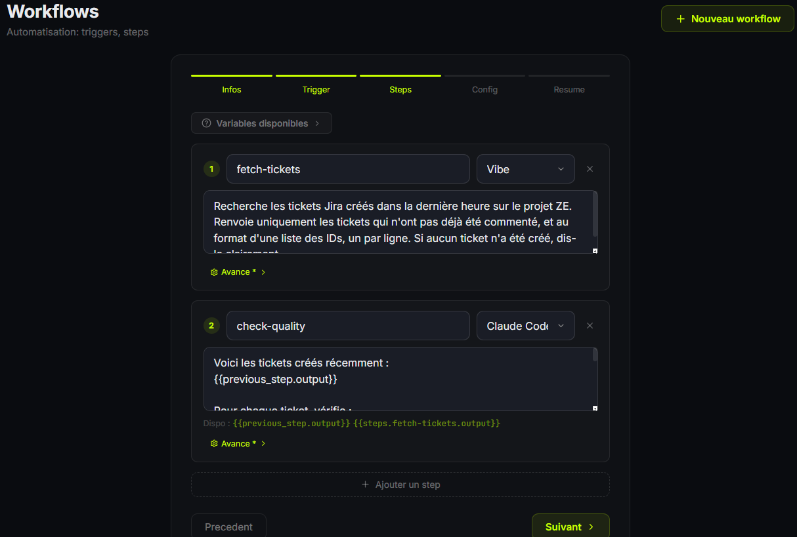

# ⚡ Kronn

> Enter the grid. Command your agents.

Self-hosted control plane for AI coding agents. Manage Claude Code, Codex, Vibe, Gemini CLI, and Kiro from a single dashboard — with unified MCP management, multi-agent debates, automated workflows, and AI-powered codebase audits.

> **Early development** — Kronn is functional but actively evolving. Expect breaking changes.

```
  ╭──╮
  │⚡│ Kronn v0.1.0
  ╰──╯ Enter the grid.
```


## Quick Start

```bash
git clone https://github.com/get-kronn/kronn.git
cd kronn
./kronn start
# → open http://localhost:3140
```

Three commands. The CLI detects your agents, offers CLI or web mode, and handles everything. First web launch opens the setup wizard.


---

## Why Kronn?

You use AI coding agents. Maybe Claude Code, maybe Codex, maybe both. Each has its own config, its own MCP setup, its own context files scattered across your repos.

You manage all of that... manually. **Kronn fixes that.**

| | Without Kronn | With Kronn |
|---|---|---|
| **Agents** | Switch between 3 CLIs, each with different flags | One dashboard, all agents, `@mentions` |
| **MCPs** | Maintain `.mcp.json`, `.vibe/config.toml`, `~/.codex/config.toml` separately per agent per repo | Configure once, sync to all projects and all agents automatically |
| **Architecture decisions** | Ask one model, get one opinion | Multi-agent debate: agents argue, then synthesize |
| **Recurring tasks** | Run manually, forget, repeat | Cron workflows with multi-step, multi-agent pipelines |
| **Incident response** | Alert → human reads logs → human fixes | Alert → agent diagnoses → agent fixes → PR + email |
| **Legacy projects** | "Nobody knows how this works" | 20-min AI audit → fully documented, AI-ready codebase |
| **Tokens** | No idea what you're spending | Per-message token tracking (Claude Code via stream-json, Codex via stderr), per-project visibility |
| **API Keys** | One key per provider, no switching | Multiple named keys per provider (personal, enterprise...) with one-click activation and per-provider override toggle |
| **Security** | Tokens in plaintext in dotfiles | AES-256-GCM encrypted, self-hosted, nothing leaves your network |
| **Language** | English-only UI | French, English, Spanish — switch in one click |

---

## Core Features

### 💬 Multi-Agent Discussions

Chat with agents in project context. Use `@claude` or `@codex` to target specific agents. **Debate mode**: agents discuss in configurable rounds (1–3, default 2) and a primary agent synthesizes — get diverse perspectives, not just one model's opinion.

Stop, retry, or edit messages mid-conversation. Unread badges with browser tab notifications. Persistent conversations backed by SQLite. Full i18n support (French, English, Spanish). Claude Code responses streamed token-by-token via `--output-format stream-json` with per-message token tracking. Archive/unarchive discussions with swipe gestures (swipe right = archive, swipe left = delete). Inline title editing (double-click or pencil icon). Disabled agent detection with grayed-out input. Multi-line input with auto-resize.


### 🔌 MCP Management

A 3-tier architecture with encrypted secrets:

```
Server (type)  →  Config (instance + secrets)  →  Project (N:N)
```

**34 built-in servers** organized by category:

| Category | Servers |
|----------|---------|
| Git & Code | GitHub, GitLab, Git (local) |
| Databases | PostgreSQL, SQLite, Redis |
| BaaS | Supabase |
| Cloud & Infra | Cloudflare, AWS CloudWatch, Docker, Azure |
| Search & Web | Brave Search, Fetch, Exa |
| Browser | Puppeteer, Chrome DevTools, Playwright, Browserbase |
| Scraping | Firecrawl |
| Monitoring | Sentry, Grafana |
| Communication | Slack |
| Email | Resend |
| Project Management | Linear, Atlassian |
| Design | Figma |
| Payments | Stripe |
| Knowledge & Docs | Notion, Context7 |
| AI & Reasoning | Memory, Sequential Thinking |
| SEO | Ahrefs |
| Files | Filesystem |
| Sandbox | E2B |

Key capabilities:
- **Auto-detection** from existing `.mcp.json` files across projects
- **Disk sync for all agents** — `.mcp.json` (Claude Code), `.kiro/settings/mcp.json` + `.ai/mcp/mcp.json` (Kiro), `.gemini/settings.json` (Gemini CLI), `.vibe/config.toml` (Vibe), `~/.codex/config.toml` (Codex) — secrets decrypted, `.gitignore` ensured
- **Inline secret editing** with per-field visibility toggles and token generation links
- **MCP context files** — per-MCP per-project instruction files (`ai/operations/mcp-servers/*.md`) auto-created and injected into agent prompts
- **Global configs** — mark a config as global to deploy to all projects at once


### ⚙️ Workflows

One system for everything: cron jobs, multi-step pipelines, issue-to-PR automation, manual triggers. Created from a 5-step UI wizard or imported from a `WORKFLOW.md` file.

MCP tools are automatically injected into agent prompts — agents use native MCP calls (e.g. `mcp__github__create_pull_request`) instead of Bash workarounds.



**Level 1 — Simple cron**: one agent, one prompt, on a schedule.
```yaml
---
trigger: { cron: "0 2 * * 1" }
agent: claude-code
---
Audit all dependencies for known vulnerabilities.
```

**Level 2 — Multi-step, multi-agent**: chain steps, different agents per step, debates.
```yaml
---
trigger: { cron: "0 9 * * *" }
steps:
  - name: scan
    agent: claude-code
    mcps: [filesystem]
    prompt: "List all TODO/FIXME comments in the codebase."
  - name: prioritize
    agents: [claude-code, codex]
    mode: debate
    rounds: 2
    prompt: "Rank these TODOs by business impact and effort."
  - name: report
    agent: claude-code
    prompt: "Generate a markdown report and create a GitHub issue."
---
```

**Level 3 — Tracker-driven (Issue → PR)**: [OpenAI Symphony](https://github.com/openai/symphony)'s pattern — but multi-agent, multi-tracker, with MCP injection.
```yaml
---
trigger:
  tracker: github
  project: "your-org/your-repo"
  filter: { labels: ["agent-ready"] }
  poll: "*/5 * * * *"
steps:
  - name: triage
    agent: claude-code
    mcps: [github]
    prompt: "Analyze issue {{issue.identifier}}: {{issue.title}}. Detailed enough?"
  - name: debate
    agents: [claude-code, codex]
    mode: debate
    rounds: 2
    prompt: "Propose an implementation for: {{issue.title}}"
  - name: implement
    agent: codex
    mcps: [filesystem, postgres]
    prompt: "Implement the chosen approach. Add tests."
  - name: review
    agent: claude-code
    mcps: [github]
    prompt: "Review the diff. If good, create a draft PR."
safety:
  sandbox: docker
  max_files_changed: 20
  approval_required: true
---
```

**Level 4 — Manual trigger**: no schedule, no tracker. Triggered from the dashboard or CLI.

<details>
<summary><strong>Symphony compatibility</strong></summary>

Kronn reads Symphony's `WORKFLOW.md` natively. Existing users can migrate without changes.

| | Symphony | Kronn |
|---|---|---|
| Trigger | Linear polling only | Cron, tracker (GitHub/Linear/GitLab/Jira), manual |
| Agent | Codex only | Any agent — per step |
| Multi-agent | No | Debate mode at any step |
| MCPs | No | Auto-injected per step |
| Post-step actions | Separate `actions` block | Done via MCP tools in steps |
| Config | WORKFLOW.md | WORKFLOW.md (superset) + dashboard UI |
| Observability | Elixir LiveView | Kronn dashboard + SSE real-time |
| Token tracking | No | Per-run, per-step, per-agent |
</details>

### 🎭 Agent Configuration (3-axis model)

Three independent axes shape how agents behave — all multi-selectable, all available in discussions and workflow steps:

#### Profiles (WHO — persona)
8 built-in agent profiles with distinct personalities, expertise, and avatars. Each profile has an editable persona name (Kai, Mia, Sam, Noa, Kim, Eve, Max, Zia) — customize even the builtins. When multiple profiles are selected, agents adopt a **collaborative mode**: consider each perspective, identify trade-offs, challenge assumptions.

| Category | Profiles |
|----------|----------|
| Technical | Architect (Kai), Tech Lead (Mia), QA Engineer (Sam) |
| Business | Product Owner (Noa), Scrum Master (Kim), Technical Writer (Eve) |
| Meta | Devil's Advocate (Max), Mentor (Zia) |

#### Skills (WHAT — domain expertise)
13 built-in skills + custom skills. Injected into agent prompts as domain knowledge.

| Category | Skills |
|----------|--------|
| Language | TypeScript Dev, Rust Dev |
| Domain | Security Auditor, DevOps Expert, SEO Expert, Green IT Expert, Data Engineer |
| Business | Product Owner, QA Engineer, Tech Lead |

#### Directives (HOW — output behavior)
Control output format, language, and verbosity. Conflict detection prevents contradictory directives.

Custom profiles, skills, and directives are stored as Markdown files with YAML frontmatter in `~/.config/kronn/`. Create, edit, and delete from the dashboard.

### 🚀 Project Bootstrap

Create a new project from scratch: name it, describe it, and Kronn creates the directory, initializes git, installs the AI template, and opens a guided discussion with an AI architect + product owner. The bootstrap conversation walks you through Vision → Architecture → Stack → MVP → Action Plan.

### 🔍 AI Audit Pipeline

Generate, review, and validate AI context documentation for any project in 4 steps:

```
NoTemplate → TemplateInstalled → Audited → Validated
```

1. **Install template** — one-click `ai/` skeleton with redirectors (`CLAUDE.md`, `.cursorrules`, `.windsurfrules`)
2. **AI audit** — 10-step automated analysis (~20 min, SSE progress bar) with **3 default expert profiles** (Architect + Tech Lead + Mentor) for multi-perspective analysis: project analysis, repo map, coding rules, testing, architecture, glossary, operations, MCP servers, tech debt, final review. **Auto-detects project skills** (languages, frameworks, tools) from config files.
3. **Validation** — dedicated discussion where the AI asks about ambiguities and updates docs after each answer in real-time
4. **Mark as validated** — injects `<!-- KRONN:VALIDATED:date -->`, project is AI-ready

> **For legacy codebases**: the audit reads every config, maps the architecture, extracts conventions in 20 minutes. The validation step captures tribal knowledge — historical decisions, undocumented workarounds, business logic edge cases. A project goes from "nobody knows how this works" to fully documented in under an hour of human time.


---

## Supported Agents

| Agent | CLI | Color | Status |
|-------|-----|-------|--------|
| Claude Code | `claude` | `#D4714E` (terracotta) | Supported |
| OpenAI Codex | `codex` | `#10a37f` (OpenAI green) | Supported |
| Vibe | `vibe` | `#FF7000` (Mistral orange) | Supported |
| Gemini CLI | `gemini` | `#4285f4` (Google blue) | Supported |
| Kiro | `kiro-cli` | `#7B61FF` (Kiro purple) | Supported |
| DeepSeek | `deepseek` | — | Planned |
| OpenCode | `opencode` | — | Planned |

Auto-detected at setup with runtime probe fallback (npx). Even without a local binary, agents available via npx are marked "runtime OK" and fully usable. Spawned in non-interactive mode, responses streamed via SSE. Per-agent permissions toggle in Config (`--dangerously-skip-permissions`, `--full-auto`, `--yolo`). Agents can be toggled on/off or uninstalled from the dashboard.


---

## Usage

```bash
./kronn start           # Interactive flow: detect agents, choose CLI or web
./kronn stop            # Stop all services
./kronn restart         # Stop and restart services
./kronn web             # Launch web interface directly
./kronn logs            # View service logs
./kronn status          # Overview: agents, repos, MCP secrets
./kronn init [path]     # Configure AI context for a repo
./kronn mcp sync        # Sync .mcp.json across repos
./kronn mcp check       # Check MCP prerequisites
./kronn mcp secrets     # Configure API tokens
./kronn help            # Show help
```

On first run, `kronn` offers to symlink itself into `~/.local/bin/` so you can use `kronn` from anywhere.

<details>
<summary><strong>Dev commands (Makefile)</strong></summary>

```bash
make start          # Build & launch (Docker)
make stop           # Stop services
make logs           # Tail logs
make clean          # Remove containers & data
make dev-backend    # Rust hot reload
make dev-frontend   # Vite dev server
make typegen        # Sync Rust → TS types
```
</details>

## Architecture

```
kronn/
├── backend/            # Rust (Axum) — API, workflows, agents, SQLite
│   └── src/
│       ├── main.rs         # Entrypoint, router, AppState
│       ├── api/            # setup, projects (+ bootstrap), agents, mcps, workflows, discussions, stats
│       ├── core/           # config, scanner, registry, mcp_scanner, crypto, profiles, directives
│       ├── agents/         # Agent runner (spawns CLIs, streams stdout)
│       ├── workflows/      # Workflow engine, triggers, steps, tracker adapters
│       ├── skills/         # 13 built-in skill profiles (Markdown + YAML frontmatter)
│       ├── profiles/      # 8 built-in agent profiles (persona + YAML frontmatter)
│       ├── directives/    # Built-in output directives (Markdown + YAML frontmatter)
│       └── models/         # Shared types → auto-exported to TS via ts-rs
├── frontend/           # React + TypeScript + Vite
│   └── src/
│       ├── App.tsx         # Setup wizard ↔ Dashboard routing
│       ├── pages/          # SetupWizard, Dashboard, SettingsPage, DiscussionsPage, McpPage, WorkflowsPage
│       ├── hooks/          # useApi
│       ├── types/          # generated.ts (from Rust — DO NOT EDIT)
│       └── lib/            # Typed API client + SSE streaming + i18n (fr/en/es)
├── ai/                 # AI context documentation (for agents working on this repo)
├── templates/          # AI context templates (for projects managed by Kronn)
├── tests/bats/         # Shell tests (bats-core, 186 tests)
├── Makefile
├── docker-compose.yml  # 3 services: backend, frontend, gateway
└── LICENSE             # AGPL-3.0
```

**Stack**: Rust (Axum 0.7) + TypeScript (React 18 / Vite) — full type safety end-to-end via `ts-rs`.

<details>
<summary><strong>Configuration</strong></summary>

Generated at first run in `~/.config/kronn/config.toml`:

```toml
[server]
host = "127.0.0.1"
port = 3140

[[tokens.keys]]
id = "abc-123"
name = "Personal API Key"
provider = "anthropic"
active = true

[[tokens.keys]]
id = "def-456"
name = "Enterprise Key"
provider = "openai"
active = true

[scan]
paths = ["~/projects", "~/work"]
ignore = ["node_modules", ".git", "target"]
scan_depth = 4

[agents.claude_code]
path = "/usr/local/bin/claude"
installed = true
```
</details>

<details>
<summary><strong>CI pipeline</strong></summary>

GitHub Actions workflow triggered by adding the `ci-test` label to a PR:
- **test-backend**: `cargo check` + `cargo clippy` + `cargo test`
- **test-frontend**: `tsc --noEmit` + `pnpm test` (218 tests, 17 suites)
- **test-shell**: `make test-shell` (186 bats tests, 8 suites)
</details>

## Security

> **Kronn does not include TLS.** Do not expose port 3140 to the internet without a properly configured TLS reverse proxy in front (nginx, Caddy, Traefik…). API keys and secrets transit in cleartext over HTTP.

> **Authentication is opt-in.** By default, all API routes are accessible without credentials. Enable Bearer token authentication in Settings to secure your instance. A warning banner is displayed in the dashboard when auth is disabled.

The built-in mini terminal (Git panel) requires `full_access` to be enabled on at least one agent. This prevents accidental shell access on shared instances.

## Requirements

- **Docker** & **Docker Compose**
- **Bash** 3.2+ (macOS, Linux, WSL)

## Contributing

Contributions welcome! See [CONTRIBUTING.md](CONTRIBUTING.md).

## License

AGPL-3.0 — See [LICENSE](LICENSE).
