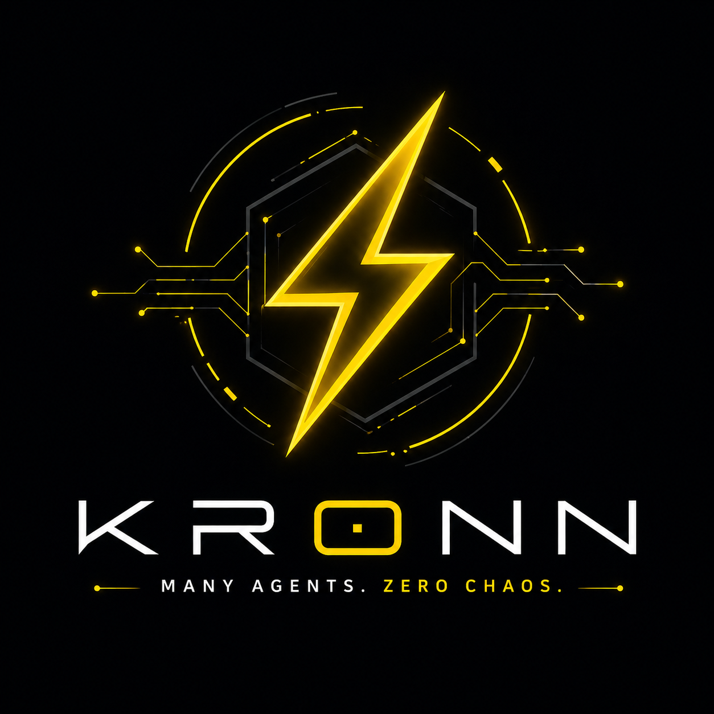
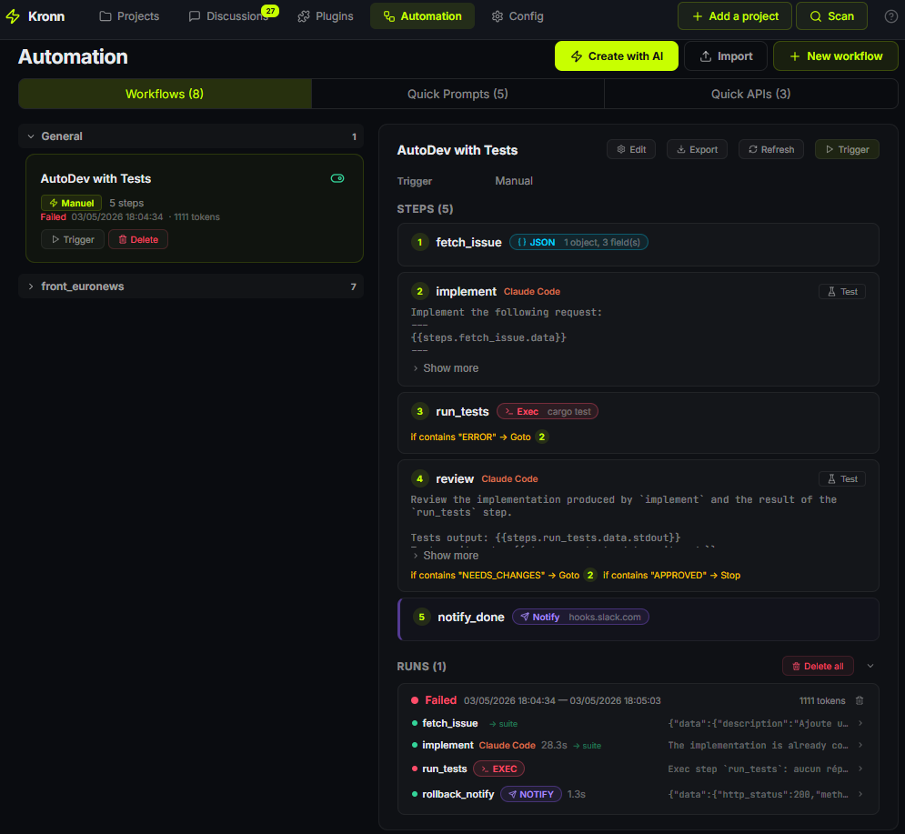

<p align="center">
  
</p>

<h1 align="center">Kronn</h1>

<p align="center"><strong><em>Many agents. Zero chaos.</em></strong></p>

<p align="center">
  
</p>

Self-hosted control plane for AI coding agents. One local backend orchestrates Claude Code, Codex, Vibe, Gemini CLI, Kiro, GitHub Copilot, and Ollama across your repos — chat, multi-step workflows, MCP (Model Context Protocol — the plugin standard agents use) configs, secrets, and tokens, in one place. Built for developers who automate their work with AI assistants and want a single dashboard instead of seven CLIs and seven MCP configs.

> Status: **0.6.0** — functional but pre-1.0. Breaking changes happen.
> License: AGPL-3.0.

---

## What you actually do with it

Plug your repos. Ask Claude Code to refactor module X while Codex audits security on module Y — same dashboard, same MCP config, secrets stay in your vault. When it works, save the prompt as a Quick Prompt, fan it out over 50 tickets, gate the PRs behind human approval. No copy-paste between terminals, no MCP file per agent.

<p align="center">
  
</p>

---

## Quick start

**Prerequisite (both modes):** at least one agent installed locally — Claude Code, Codex, Vibe, Kiro, Gemini CLI, GitHub Copilot CLI, or [Ollama](https://ollama.com) for fully-local models (Llama, Gemma, Qwen…). Kronn drives the runtime you already use; it does not ship its own LLM. The setup wizard auto-detects what's on your `$PATH` (with an `npx` runtime fallback for npm-published agents).

Pick the install mode that fits:

**Desktop app** (one user, one machine — recommended for solo use)
Download the installer for your OS from [Releases](https://github.com/DocRoms/Kronn/releases/latest). No Docker, no extra runtime. Per-OS steps in [docs/install.md](docs/install.md).

**Self-hosted** (team-shared, always-on, headless server)
Requires Docker + Docker Compose. On Windows, WSL2 (Docker Engine inside WSL works — Docker Desktop optional).

```bash
git clone https://github.com/DocRoms/kronn.git
cd kronn
./kronn start
# → http://localhost:3140
```

In both modes the setup wizard scans your repos and walks you through API keys.

### Day 1 — first 5 minutes

1. **Open a project** the wizard found (or add one). Kronn scans existing `.mcp.json` and adopts MCPs automatically.
2. **Start a discussion**, pick an agent, ask something. The agent runs locally with your MCPs injected — no manual config per CLI.
3. **Save a useful prompt** as a Quick Prompt with `{{variables}}`. One-shot or fan-out (Batch) over a list of items.

When you want orchestration (multi-step, conditional, scheduled, gated), graduate to a Workflow.

---

## Core concepts

### Objects you create
- **Project** — a git repo Kronn knows about. Tracks AI context, MCPs, workflows, audit state.
- **Discussion** — a chat thread bound (or not) to a project. Single agent or multi-agent debate (N rounds). Streams in real-time via SSE (server-sent events), persisted in SQLite, optionally isolated in a git worktree (Git's "multiple working trees" feature — lets two branches coexist on disk).
- **Quick Prompt** — reusable prompt template with `{{variables}}` and conditional sections. One-shot or fan-out over a list.
- **Workflow** — a multi-step pipeline. See below.

### How agents are shaped
Three layers injected into the agent's system prompt — independent axes:

| Layer | Answers | Example |
|---|---|---|
| **Profile** | WHO is talking | "Senior backend engineer" / "Tech writer" |
| **Skill** | WHAT it knows | "Rust ownership" / "JSONPath RFC 9535" |
| **Directive** | HOW it talks | "Concise, no apologies" / "Always reference the file path" |

17 default profiles, 25 default skills, custom ones via Markdown + YAML in `~/.config/kronn/`.

### Integrations
- **Plugin (MCP / API / hybrid)** — configure once with encrypted secrets, link to projects N:N. MCPs sync to the right config file per agent (`.mcp.json` for Claude Code, `~/.codex/config.toml` for Codex, etc.). API plugins inject endpoints + auth into the system prompt so the agent calls them via `Bash curl` — no MCP server needed. OAuth2 client-credentials handled transparently.

---

## Workflow engine

A multi-step pipeline triggered by cron, by a tracker (Jira issue / GitHub PR), or manually. Built via UI wizard or a `WORKFLOW.md` file (Symphony-compatible — see [docs/install.md](docs/install.md) for the spec format).

### Canonical example — Auto-Dev with tests

```
fetch_issue (JsonData)
  payload: { key, title, description }     # fixture, swap to ApiCall when you wire a tracker

implement (Agent: ClaudeCode)
  prompt: "Implement the following request:
           ---
           {{steps.fetch_issue.data}}
           ---
           If a previous review left feedback: {{state.last_review}}"

run_tests (Exec: cargo test)
  on_result:
    contains "ERROR" → goto implement (max 5 iterations)

review (Agent: ClaudeCode)
  prompt: "Review the implementation. Tests stdout: {{steps.run_tests.data.stdout}}
           If OK end with [SIGNAL: APPROVED].
           Else write ---STATE:last_review=<feedback>--- then [SIGNAL: NEEDS_CHANGES]"
  on_result:
    contains "NEEDS_CHANGES" → goto implement (max 5 iterations)
    contains "APPROVED" → stop

notify_done (Notify): POST {webhook} "Auto-Dev complete: {{steps.review.summary}}"

# on_failure (rollback chain — fires only on runtime Failed)
rollback_notify (Notify): POST {webhook} "Auto-Dev failed at {{failed_step.name}}"
```

That covers a fixture-first data source you can swap for a real API later, loops with feedback, deterministic shell execution, structured outputs, a final notification, and a rollback chain — all in ~20 lines. The wizard produces this from a one-click preset; you don't have to write the spec by hand.

<p align="center">
  
</p>

### 7 step types
- **Agent** — run a CLI agent with auto-injected MCPs, profiles, skills. Can reference a saved Quick Prompt via `quick_prompt_id` — the runtime loads its `prompt_template`, `tier`, and `skill_ids`, with per-field override at the step level.
- **ApiCall** — hit an API plugin directly from the Rust engine. **Zero tokens** (no LLM in the loop). JSONPath extraction, auto-pagination (Jira / Cloudflare GraphQL / Stripe-style cursors), SSRF-hardened. Can reference a saved Quick API via `quick_api_id` — same per-field override pattern, define the canonical call once and reuse it across N workflows.
- **JsonData** — emit a literal JSON payload as the step's structured envelope. **Zero tokens, zero network.** Use it to feed a downstream Batch on a fixed list (10 hosts, 5 regions, dev fixture) without standing up an API. Validated at save (≤ 1 MiB, valid JSON).
- **Batch** — fan-out a Quick Prompt over a list (tickets, JSON path, static items, `JsonData` payload). Optional per-item worktree.
- **Notify** — webhook POST/PUT/GET. Zero tokens.
- **Gate** — human approval. Run pauses with `WaitingApproval` until the operator decides via UI or `POST /decide`. Optional notify-on-pause webhook.
- **Exec** — run a binary from the workflow's allowlist. No `sh -c`, args are argv literals — no shell interpolation.

### What the engine guarantees
- **Guards** stop runaway runs (timeout, max LLM calls, loop detection) with a distinct `StoppedByGuard` status — orange in UI, not red.
- **Loops** via backward jumps. Agents emit `---STATE:k=v---` lines persisted on the run row, exposed as `{{state.X}}` and `{{iter.X}}` in next iterations.
- **Structured outputs** validate against a JSON Schema with auto-repair retry on failure.
- **Rollback** fires `on_failure` steps only on `Failed` (not Cancelled, not StoppedByGuard, not Gate reject).
- **Honest run history** — every step result snapshots what actually ran. Editing the workflow doesn't rewrite past runs.
- **Launch variables** mirror Quick Prompts. Manual launch shows a form, values become `{{var_name}}` in step prompts. The wizard live-warns if a prompt references an undeclared `{{var}}`.
- **Per-item Export/Import** — single-file JSON for Workflows + Quick Prompts, share between machines.

Reference for contributors: [`ai/index.md`](ai/index.md) (workflow engine sections + "Plugin kind: MCP | API | hybrid").

---

## When Kronn fits — and when it doesn't

**Fits** if you run multiple AI CLIs, want one dashboard, want to industrialize repeatable runs (PR review, audit, generate-from-spec, batch over tickets), and prefer self-hosted with secrets in your vault.

**Doesn't fit** for pure RAG pipelines, agents-over-API-only stacks (LangGraph + LiteLLM is the better path), or workloads needing managed multi-tenancy. Kronn is a **runner of CLI agents on local files**, not a Python LLM framework.

**Why not n8n / Temporal / LangGraph?** n8n is generic automation (no agent context, no MCP). Temporal is durable execution at scale (overkill, no AI primitives). LangGraph is in-process Python orchestration (no CLI agents, no MCP plumbing). Kronn fills the niche where you orchestrate *external* AI CLIs across local repos.

---

## Architecture in one paragraph

Backend Rust + axum + SQLite (WAL mode, local file at `~/.config/kronn/data.json` or container volume) on a Tokio runtime. Frontend React 19 + Vite, types shared with the backend via `ts-rs` (no schema drift). Agents run as external processes — Kronn spawns the right CLI with the right env, parses streaming output, persists per-step results. Secrets live in an AES-256-GCM vault. Nothing leaves your machine unless you opt-in to P2P contact sharing. Full schema: [`ai/architecture/overview.md`](ai/architecture/overview.md).

---

## Other features (sorted by use case)

**Quality & oversight** — AI-driven repo audit (~50–150K tokens, breakdowns by file/topic), structured questions surfaced from agent output, run timeline with edit history, per-step token tracking.

**Productivity** — multi-agent debate (N rounds for adversarial reasoning), voice mode (mic-in / TTS-out), generate docs from spec, secret theme switcher.

**Distribution & infra** — P2P contact sharing (Tailscale-friendly, opt-in), bidirectional host MCP sync (Kronn ↔ `~/.claude.json`, `~/.codex/config.toml`, `.gemini/settings.json`), RTK (token-saving CLI wrapper) integration.

---

## CLI

```bash
./kronn start              # Docker mode (default)
./kronn stop
./kronn status             # Cross-checks API + container state
./kronn logs [service]
./kronn restart            # Smart restart (no downtime if config didn't drift)
./kronn dev                # Frontend dev server + backend hot-reload
./kronn agents             # List installed CLIs + Kronn-detected status
./kronn projects           # List / add / remove projects
./kronn mcp sync           # Force resync host MCP files
```

---

## Security notes

- **No TLS shipped.** Run behind a reverse proxy (nginx, Caddy, Tailscale Funnel) for non-localhost use.
- **SSRF-hardened API plugins** — blocks loopback, RFC1918 (private IPv4 ranges like `10.0.0.0/8`), link-local, IPv6 ULA (Unique Local Address `fc00::/7`), with DNS-rebind detection.
- **Exec step** is allowlist-gated per workflow, no `sh -c`, args are argv literals — no shell interpolation possible from templated values.
- **Secrets** encrypted at rest with AES-256-GCM. Redacted from agent stdout and logs.
- Threat model details: [`ai/operations/secret-themes.md`](ai/operations/secret-themes.md) and the workflow engine sections of [`ai/index.md`](ai/index.md).

---

## Links

- [Install guide](docs/install.md) — Docker, Tauri desktop, WSL2 specifics
- [`ai/index.md`](ai/index.md) — full architecture reference for contributors
- [CONTRIBUTING.md](CONTRIBUTING.md)
- [LICENSE](LICENSE) — AGPL-3.0
