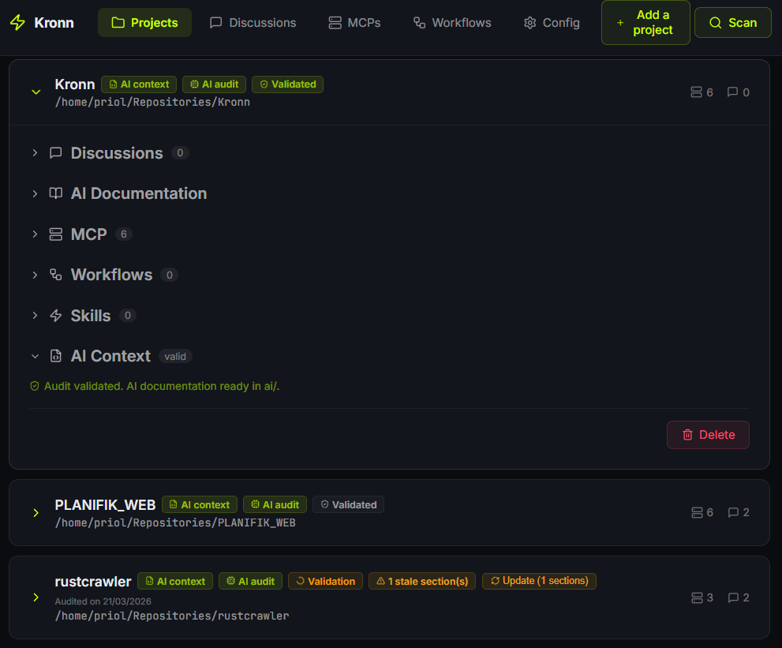
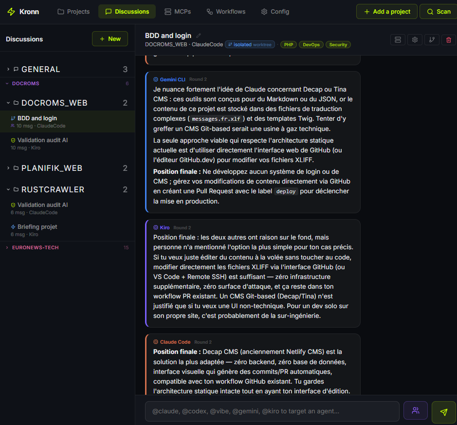
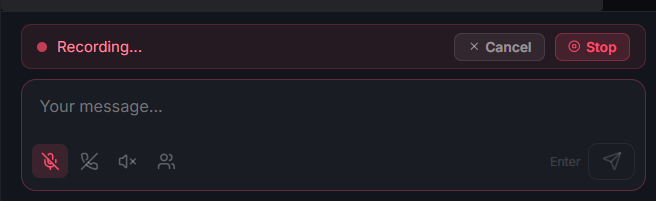

# ⚡ Kronn

Self-hosted control plane for AI coding agents.
Orchestrate Claude Code, Codex, Vibe, Gemini CLI, Kiro, and Ollama (local models) — with less waste.

> Enter the grid. Command your agents.

> **Early development** — Kronn is functional but actively evolving. Expect breaking changes.

---

## Why Kronn?

You use AI coding agents. Maybe Claude Code, maybe Codex, maybe both. Each has its own config, its own MCP setup, its own context files scattered across your repos. You manage all of that... manually.

**Kronn fixes that.** Every feature is designed to reduce unnecessary compute — document once instead of letting agents explore blindly, persist context instead of rebuilding it from scratch, frame agents with profiles and skills so they get it right on the first try.

| | Without Kronn | With Kronn |
|---|---|---|
| **Agents** | Switch between 3+ CLIs, each with different flags | One dashboard, all agents, `@mentions` |
| **MCPs** | Maintain separate configs per agent per repo | Configure once, sync to all projects and all agents |
| **Architecture decisions** | Ask one model, get one opinion | Multi-agent debate: agents argue, then synthesize |
| **Recurring tasks** | Run manually, forget, repeat | Cron workflows with multi-step, multi-agent pipelines |
| **Legacy projects** | "Nobody knows how this works" | 20-min AI audit → fully documented, AI-ready codebase |
| **Tokens** | No idea what you're spending | Per-message cost tracking, usage dashboard with daily history, provider breakdown, project-level visibility |
| **API Keys** | One key per provider, no switching | Multiple named keys per provider with one-click activation |
| **Security** | Tokens in plaintext in dotfiles | AES-256-GCM encrypted, self-hosted, nothing leaves your network |
| **Waste** | Agents explore blindly, rebuild context daily, retry on bad answers | Document once, persist context, get it right first try |

---

## Get Started

### Desktop App (recommended)

Download, install, launch. No Docker, no CLI, no config.

**[Download latest release](https://github.com/DocRoms/Kronn/releases/latest)** — `.msi` (Windows), `.dmg` (macOS), `.deb` / `.AppImage` (Linux).

The setup wizard detects your agents and repositories automatically.

### Self-hosted (Docker)

For those who want full control, multi-user P2P sync, or server deployment.

**Prerequisites:** Docker + Docker Compose. Windows requires WSL2.

```bash
git clone https://github.com/DocRoms/kronn.git
cd kronn
./kronn start
# → open http://localhost:3140
```

**[Full installation guide (Linux / macOS / Windows)](docs/install.md)**



---

## Core Features

### Multi-Agent Discussions

Chat with agents in project context. Use `@claude` or `@codex` to target specific agents. **Debate mode**: agents discuss in configurable rounds (1-3) and a primary agent synthesizes.

Persistent conversations backed by SQLite. Full i18n (French, English, Spanish). Claude Code streamed token-by-token with per-message tracking. **Switch agent mid-conversation** — click the agent name to switch; the new agent auto-summarizes and continues. Archive, retry, edit, search, swipe gestures, multi-line input.



### Multi-User P2P

Share discussions between Kronn instances via WebSocket. Replicated model: each peer stores a full copy, messages sync in real-time. Auto-detection of Tailscale, VPN, and LAN networks. Network diagnostics on connection failures.

### MCP Management

A 3-tier architecture with encrypted secrets:

```
Server (type)  →  Config (instance + secrets)  →  Project (N:N)
```

**49 built-in servers** covering Git, databases, cloud & infra, browsers, monitoring, communication, project management, design, payments, knowledge bases, AI reasoning, SEO, code quality, IaC, and hosting. [Full list →](docs/mcps.md)

- **Auto-detection** from existing `.mcp.json` files across projects
- **Disk sync for all agents** — `.mcp.json` (Claude), `.kiro/settings/mcp.json` (Kiro), `.gemini/settings.json` (Gemini), `.vibe/config.toml` (Vibe), `~/.codex/config.toml` (Codex), `~/.copilot/mcp-config.json` (Copilot)
- **Smart dedup** — detects when the same MCP uses different runtimes (e.g. npm package vs Go binary) and merges them automatically
- **Inline secret editing** with per-field visibility toggles and token generation links
- **Global configs** — mark a config as global to deploy to all projects at once


### Workflows

One system for everything: cron jobs, multi-step pipelines, issue-to-PR automation, manual triggers, and **webhook notifications** (Notify step — zero tokens, direct HTTP call). Created from a 5-step UI wizard or imported from a `WORKFLOW.md` file. MCP tools auto-injected into agent prompts.

**Level 1 — Simple cron**: one agent, one prompt, on a schedule.
```yaml
---
trigger: { cron: "0 2 * * 1" }
agent: claude-code
---
Audit all dependencies for known vulnerabilities.
```

**Level 2 — Multi-step, multi-agent**: chain steps, different agents per step, debates.
```yaml
---
trigger: { cron: "0 9 * * *" }
steps:
  - name: scan
    agent: claude-code
    mcps: [filesystem]
    prompt: "List all TODO/FIXME comments in the codebase."
  - name: prioritize
    agents: [claude-code, codex]
    mode: debate
    rounds: 2
    prompt: "Rank these TODOs by business impact and effort."
  - name: report
    agent: claude-code
    prompt: "Generate a markdown report and create a GitHub issue."
---
```

**Level 3 — Tracker-driven (Issue → PR)** and **Level 4 — Manual trigger**: see [Workflow documentation](docs/workflows.md).

<details>
<summary><strong>Symphony compatibility</strong></summary>

Kronn reads [OpenAI Symphony](https://github.com/openai/symphony)'s `WORKFLOW.md` natively. Existing users can migrate without changes. Kronn extends the pattern with: any trigger (cron, GitHub/Linear/GitLab/Jira, manual), any agent per step, debate mode, auto-injected MCPs, dashboard UI, and per-run token tracking.

</details>

### Agent Configuration (3-axis model)

Three independent axes shape how agents behave — all multi-selectable, all available in discussions and workflow steps:

**Profiles (WHO)** — 17 built-in personas with distinct perspectives and avatars.

| Category | Profiles |
|----------|----------|
| Technical | Architect, Tech Lead, QA Engineer, Game Developer, Staff Engineer |
| Business | Product Owner, Scrum Master, Technical Writer, Entrepreneur, UX Designer, Translator/Teacher |
| Data | Data Analyst, Data Engineer |
| Operations | SRE/DevOps, SEO/Growth |
| Meta | Devil's Advocate, Mentor |

**Skills (WHAT)** — 25 built-in domain expertise, injected as knowledge.

| Category | Skills |
|----------|--------|
| Language | Rust, TypeScript, Python, Go, PHP, Java, Kotlin, Swift, C# |
| Domain | Security, DevOps, Data Engineering, Database, Terraform/IaC, Testing, API Design, Mobile |
| Business | SEO, Web Performance, Green IT, Accessibility, GDPR |

**Directives (HOW)** — control output format and verbosity. Conflict detection prevents contradictory combinations.

Custom profiles, skills, and directives are Markdown files with YAML frontmatter in `~/.config/kronn/`. Create, edit, and delete from the dashboard.

### AI Audit Pipeline

Generate, review, and validate AI context documentation for any project in 4 steps:

```
NoTemplate → TemplateInstalled → Audited → Validated
```

1. **Install template** — one-click `ai/` skeleton with redirectors (`CLAUDE.md`, `.cursorrules`, `.windsurfrules`)
2. **AI audit** — 10-step automated analysis (~20 min, SSE progress) with 3 expert profiles: project analysis, repo map, coding rules, testing, architecture, glossary, operations, MCP servers, tech debt, final review
3. **Validation** — interactive Q&A where the AI asks about ambiguities and updates docs in real-time
4. **Mark as validated** — project is AI-ready

Optional **pre-audit briefing**: 5 quick questions about purpose, stack, team, conventions, and watch points.

**Drift detection**: compares source file checksums against stored data, reports stale sections without consuming tokens. Partial re-audit re-runs only stale steps.


### Voice — TTS & STT (100% Local)

Talk to your agents. No cloud, no API, no data leaves your machine.

- **Speech-to-Text** — Whisper WASM via `@huggingface/transformers`. Three model sizes (Tiny/Base/Small).
- **Text-to-Speech** — Piper WASM via `@diffusionstudio/vits-web`. 9 voices across FR/EN/ES.
- **Voice Conversation Mode** — hands-free loop: speak → send → agent responds → TTS reads → mic auto-starts.

All models downloaded on first use and cached locally.



### More Features

- **Usage Dashboard** — real-time token consumption and cost estimation across all providers. Summary cards, provider breakdown bar, per-project horizontal bars, daily history chart (30 days, stacked by provider). Toggle between token count and USD cost view. Filter by discussions or workflows. Click a discussion name to navigate directly to it
- **Project Bootstrap** — create a new project from scratch with an AI architect guiding Vision → Architecture → Stack → MVP → Action Plan
- **Worktree Isolation** — each discussion/workflow runs in its own git worktree. Lock/Unlock for local testing
- **Agent Incompatibility** — Kronn tracks per-agent limitations and auto-excludes incompatible agents from steps
- **Guided Tour** — 17-step interactive onboarding for new users. Auto-launched on first visit, replayable from "?" button. 4 learn-by-doing steps where the user clicks the real UI (pulse animation). Spotlight overlay with auto-positioned tooltips. Keyboard navigation (Escape/arrows). Mobile-responsive

---

## Supported Agents

| Agent | CLI | Status |
|-------|-----|--------|
| Claude Code | `claude` | ✅ Supported |
| OpenAI Codex | `codex` | ✅ Supported |
| Vibe | `vibe` | ✅ Supported (CLI + direct Mistral API) |
| Gemini CLI | `gemini` | ✅ Supported |
| Kiro | `kiro-cli` | ✅ Supported |
| GitHub Copilot | `copilot` | ✅ Supported |
| **Ollama (local)** | `ollama` | ✅ Supported (100% local, zero cost) |
| DeepSeek | `deepseek` | Planned |
| OpenCode | `opencode` | Planned |

Auto-detected at setup with runtime probe fallback (npx). Per-agent permissions toggle. Multiple named API keys per provider. **Ollama**: runs models locally (Llama, Gemma, Codestral, Qwen) — setup wizard in Settings with health check, model suggestions, and contextual install instructions per OS.


---

## CLI Usage

```bash
./kronn start           # Interactive flow: detect agents, choose CLI or web
./kronn stop            # Stop all services
./kronn restart         # Stop and restart services
./kronn web             # Launch web interface directly
./kronn logs            # View service logs
./kronn status          # Overview: agents, repos, MCP secrets
./kronn init [path]     # Configure AI context for a repo
./kronn mcp sync        # Sync MCP configs across repos
./kronn help            # Show help
```

<details>
<summary><strong>Dev commands</strong></summary>

```bash
make start          # Build & launch (Docker)
make stop           # Stop services
make logs           # Tail logs
make dev-backend    # Rust hot reload
make dev-frontend   # Vite dev server
make typegen        # Sync Rust → TS types
make bump V=x.y.z   # Bump version everywhere
```
</details>

---

## Architecture

```
kronn/
├── backend/            # Rust (Axum) — API, workflows, agents, SQLite
│   └── src/
│       ├── api/            # setup, projects, agents, mcps, workflows, discussions, contacts
│       ├── core/           # config, scanner, registry, crypto, cmd helpers, profiles, directives
│       ├── agents/         # Agent runner (spawns CLIs, streams stdout)
│       ├── workflows/      # Workflow engine, triggers, steps
│       ├── skills/         # 22 built-in (Markdown + YAML frontmatter)
│       ├── profiles/       # 17 built-in agent profiles
│       └── directives/     # Output directives
├── frontend/           # React 18 + TypeScript + Vite
│   └── src/
│       ├── pages/          # SetupWizard, Dashboard, Settings, Discussions, MCPs, Workflows
│       ├── types/          # generated.ts (from Rust via ts-rs)
│       └── lib/            # Typed API client + SSE + i18n (fr/en/es) + TTS/STT engines
├── desktop/            # Tauri desktop app (backend embedded, no Docker needed)
├── ai/                 # AI context (for agents working on Kronn itself)
├── templates/          # AI context templates (for managed projects)
├── tests/bats/         # 186 shell tests (bats-core)
├── docker-compose.yml  # 3 services: backend, frontend, gateway
└── LICENSE             # AGPL-3.0
```

**Stack**: Rust (Axum 0.7) + TypeScript (React 18 / Vite) — full type safety end-to-end via `ts-rs`.

<details>
<summary><strong>Configuration</strong></summary>

Generated at first run in `~/.config/kronn/config.toml`:

```toml
[server]
host = "127.0.0.1"
port = 3140

[[tokens.keys]]
id = "abc-123"
name = "Personal API Key"
provider = "anthropic"
active = true

[scan]
paths = ["~/projects", "~/work"]
ignore = ["node_modules", ".git", "target"]
scan_depth = 4
```
</details>

<details>
<summary><strong>CI pipeline</strong></summary>

GitHub Actions triggered by `ci-test` label on PRs:
- **test-backend**: `cargo check` + `cargo clippy` + `cargo test` (~890 tests)
- **test-frontend**: `tsc --noEmit` + `pnpm test` (~350 tests, 24 suites)
- **test-shell**: `make test-shell` (186 bats tests, 8 suites)
- **desktop-build**: `.github/workflows/desktop-build.yml` — builds Tauri installers for Windows, macOS, and Linux
</details>

---

## Security

> **Kronn does not include TLS.** Do not expose port 3140 without a TLS reverse proxy (nginx, Caddy, Traefik...).

> **Authentication is on by default.** A Bearer token is auto-generated at first launch. Localhost requests bypass auth. Remote peers require the token.

---

## Philosophy

Kronn is built on a simple principle: **every token that doesn't need to be spent, shouldn't be.**

AI agents run on physical hardware with a finite lifespan. Every unnecessary inference cycle wears down GPUs and TPUs, accelerates replacements, and adds to the environmental cost of our industry. Kronn's features minimize waste: document codebases so agents don't explore blindly, persist context so it's never rebuilt, frame agents so they get it right the first time.

The long-term vision: **de-agentify what doesn't need an agent.** MCPs are APIs — when a workflow step is mechanical (post to Slack, create a ticket), a direct API call costs zero tokens. Agent intelligence should be reserved for tasks that actually need reasoning.

---

## Contributing

Contributions welcome! See [CONTRIBUTING.md](CONTRIBUTING.md).

## License

AGPL-3.0 — See [LICENSE](LICENSE).
