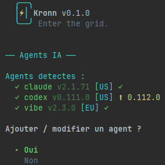
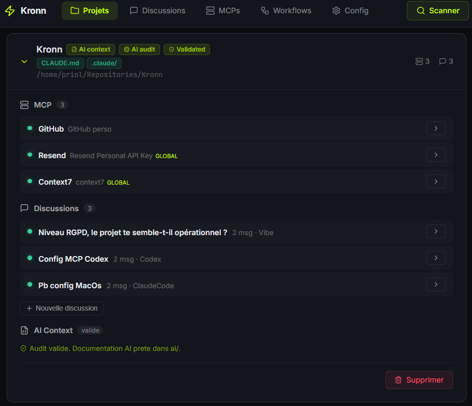
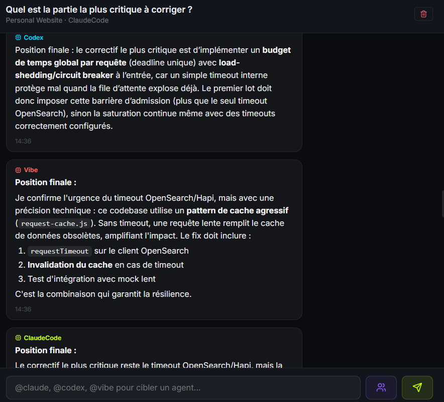
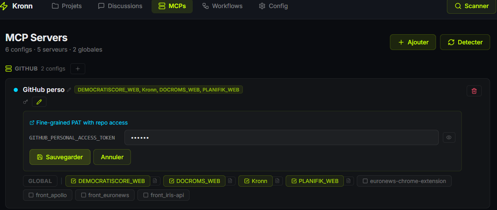
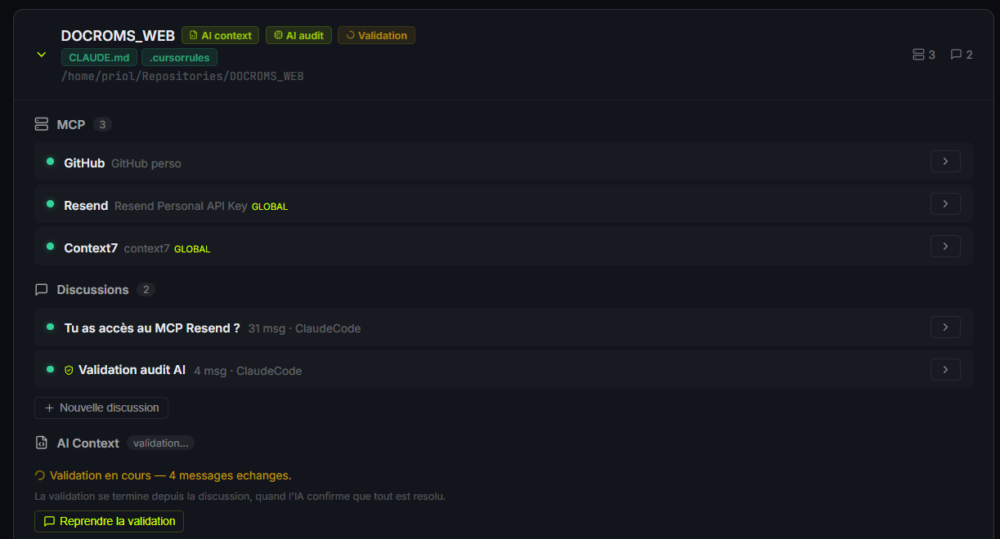
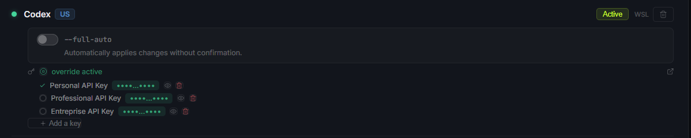

# ⚡ Kronn

Self-hosted control plane for AI coding agents.
Orchestrate Claude Code, Codex, Vibe, Gemini CLI, and Kiro — with less waste.

> Enter the grid. Command your agents.

> **Early development** — Kronn is functional but actively evolving. Expect breaking changes.

```
  ╭──╮
  │⚡│ Kronn v0.1.0
  ╰──╯ Enter the grid.
```



## Quick Start

```bash
git clone https://github.com/DocRoms/kronn.git
cd kronn
./kronn start
# → open http://localhost:3140
```

Three commands. The CLI detects your agents, offers CLI or web mode, and handles everything. First web launch opens the setup wizard.



---

## Why Kronn?

You use AI coding agents. Maybe Claude Code, maybe Codex, maybe both. Each has its own config, its own MCP setup, its own context files scattered across your repos. You manage all of that... manually.

**Kronn fixes that.** And every feature is designed to reduce unnecessary compute — document once instead of letting agents explore blindly every time, persist context instead of rebuilding it from scratch, frame agents with profiles and skills so they get it right on the first try.

AI is powerful — but every wasted token is wasted energy, wasted hardware, wasted resources.

| | Without Kronn | With Kronn |
|---|---|---|
| **Agents** | Switch between 3+ CLIs, each with different flags | One dashboard, all agents, `@mentions` |
| **MCPs** | Maintain separate configs per agent per repo | Configure once, sync to all projects and all agents |
| **Architecture decisions** | Ask one model, get one opinion | Multi-agent debate: agents argue, then synthesize |
| **Recurring tasks** | Run manually, forget, repeat | Cron workflows with multi-step, multi-agent pipelines |
| **Legacy projects** | "Nobody knows how this works" | 20-min AI audit → fully documented, AI-ready codebase |
| **Tokens** | No idea what you're spending | Per-message tracking, per-project visibility |
| **API Keys** | One key per provider, no switching | Multiple named keys per provider with one-click activation |
| **Security** | Tokens in plaintext in dotfiles | AES-256-GCM encrypted, self-hosted, nothing leaves your network |
| **Waste** | Agents explore blindly, rebuild context daily, retry on bad answers | Document once, persist context, get it right first try |

---

## Core Features

### 💬 Multi-Agent Discussions

Chat with agents in project context. Use `@claude` or `@codex` to target specific agents. **Debate mode**: agents discuss in configurable rounds (1–3) and a primary agent synthesizes — get diverse perspectives, not just one model's opinion.

Persistent conversations backed by SQLite — no context rebuilt from scratch, every resumed conversation is compute saved. Full i18n support (French, English, Spanish). Claude Code responses streamed token-by-token with per-message token tracking. Archive, retry, edit, swipe gestures, multi-line input with auto-resize.



### 🔌 MCP Management

A 3-tier architecture with encrypted secrets:

```
Server (type)  →  Config (instance + secrets)  →  Project (N:N)
```

**34 built-in servers** covering Git, databases, cloud & infra, browsers, monitoring, communication, project management, design, payments, knowledge bases, AI reasoning, SEO, and sandboxing. [Full list →](docs/mcps.md)

Key capabilities:
- **Auto-detection** from existing `.mcp.json` files across projects
- **Disk sync for all agents** — `.mcp.json` (Claude), `.kiro/settings/mcp.json` (Kiro), `.gemini/settings.json` (Gemini), `.vibe/config.toml` (Vibe), `~/.codex/config.toml` (Codex) — secrets decrypted, `.gitignore` ensured
- **Inline secret editing** with per-field visibility toggles and token generation links
- **MCP context files** — per-MCP per-project instruction files (`ai/operations/mcp-servers/*.md`) auto-injected into agent prompts
- **Global configs** — mark a config as global to deploy to all projects at once



### ⚙️ Workflows

One system for everything: cron jobs, multi-step pipelines, issue-to-PR automation, manual triggers. Created from a 5-step UI wizard or imported from a `WORKFLOW.md` file. MCP tools are automatically injected into agent prompts.

**Level 1 — Simple cron**: one agent, one prompt, on a schedule.
```yaml
---
trigger: { cron: "0 2 * * 1" }
agent: claude-code
---
Audit all dependencies for known vulnerabilities.
```

**Level 2 — Multi-step, multi-agent**: chain steps, different agents per step, debates.
```yaml
---
trigger: { cron: "0 9 * * *" }
steps:
  - name: scan
    agent: claude-code
    mcps: [filesystem]
    prompt: "List all TODO/FIXME comments in the codebase."
  - name: prioritize
    agents: [claude-code, codex]
    mode: debate
    rounds: 2
    prompt: "Rank these TODOs by business impact and effort."
  - name: report
    agent: claude-code
    prompt: "Generate a markdown report and create a GitHub issue."
---
```

**Level 3 — Tracker-driven (Issue → PR)** and **Level 4 — Manual trigger**: see [Workflow documentation](docs/workflows.md).

<details>
<summary><strong>Symphony compatibility</strong></summary>

Kronn reads [OpenAI Symphony](https://github.com/openai/symphony)'s `WORKFLOW.md` natively. Existing users can migrate without changes. Kronn extends the pattern with: any trigger (cron, GitHub/Linear/GitLab/Jira, manual), any agent per step, debate mode, auto-injected MCPs, dashboard UI, and per-run token tracking.

</details>

### 🎭 Agent Configuration (3-axis model)

Three independent axes shape how agents behave — all multi-selectable, all available in discussions and workflow steps:

**Profiles (WHO)** — 11 built-in personas with distinct perspectives and avatars.

| Category | Profiles |
|----------|----------|
| Technical | Architect, Tech Lead, QA Engineer, Game Developer |
| Business | Product Owner, Scrum Master, Technical Writer, Entrepreneur, UX Designer |
| Meta | Devil's Advocate, Mentor |

**Skills (WHAT)** — 22 built-in domain expertise, injected as knowledge.

| Category | Skills |
|----------|--------|
| Language | Rust, TypeScript, Python, Go, PHP, Java, Kotlin, Swift, C# |
| Domain | Security, DevOps, Data Engineering, Database, Terraform/IaC, Testing, API Design, Mobile |
| Business | SEO, Web Performance, Green IT, Accessibility, GDPR |

**Directives (HOW)** — control output format and verbosity. Conflict detection prevents contradictory combinations.

Custom profiles, skills, and directives are Markdown files with YAML frontmatter in `~/.config/kronn/`. Create, edit, and delete from the dashboard.

### 🔍 AI Audit Pipeline

Generate, review, and validate AI context documentation for any project in 4 steps:

```
NoTemplate → TemplateInstalled → Audited → Validated
```

1. **Install template** — one-click `ai/` skeleton with redirectors (`CLAUDE.md`, `.cursorrules`, `.windsurfrules`)
2. **AI audit** — 10-step automated analysis (~20 min, SSE progress) with 3 expert profiles (Architect + Tech Lead + Mentor): project analysis, repo map, coding rules, testing, architecture, glossary, operations, MCP servers, tech debt, final review. Auto-detects project skills from config files.
3. **Validation** — interactive Q&A where the AI asks about ambiguities and updates docs in real-time
4. **Mark as validated** — injects `<!-- KRONN:VALIDATED:date -->`, project is AI-ready

> The audit costs tokens once. It saves tokens on every conversation that follows.

Optional **pre-audit briefing**: 5 quick questions about purpose, stack, team, conventions, and watch points — written to `ai/briefing.md` and injected into every audit step.



### 🎙️ Voice — TTS & STT (100% Local)

Talk to your agents. Literally. No cloud, no API, no data leaves your machine.

**Speech-to-Text (STT)** — Whisper WASM via `@huggingface/transformers`. Click the mic, speak, click stop (or press Enter/Space). Your speech is transcribed locally and appears in the textarea. Three model sizes: Tiny (~40MB), Base (~140MB), Small (~460MB) — configurable in Settings.

**Text-to-Speech (TTS)** — Piper WASM via `@diffusionstudio/vits-web`. Agent responses are read aloud with natural voices. Sentence-by-sentence pipelining (next sentence synthesizes while current one plays). Pause/resume per message. 9 voices across 3 languages, male and female:

| Language | Voices |
|----------|--------|
| Français | UPMC (M), Siwis (F), Tom (M) |
| English | HFC Female (F), HFC Male (M), Lessac (F) |
| Español | Sharvard (M), DaveFX (M), Ald MX (F) |

**Voice Conversation Mode** — hands-free loop: speak → auto-send → agent responds → TTS reads → countdown 3-2-1 → mic auto-starts → repeat. Toggle with the phone icon in the composer toolbar.

All models are downloaded on first use and cached in the browser (IndexedDB / OPFS). Configurable in Settings > Voice.

### 🛡️ Drift Detection & Partial Re-audit

After an audit, Kronn tracks source file checksums in `ai/checksums.json`. The drift endpoint compares current files against stored checksums and reports stale sections — **without consuming tokens**. A partial re-audit re-runs only the stale steps (~3-5K tokens vs ~20K for a full audit). Stale projects show an amber badge with an update button.

### 🚀 Project Bootstrap

Create a new project from scratch: name it, describe it, and Kronn creates the directory, initializes git, installs the AI template, and opens a guided discussion with an AI architect + product owner + entrepreneur walking you through Vision → Architecture → Stack → MVP → Action Plan.

### 🌿 Worktree Isolation

Each discussion and workflow can run in its own isolated git worktree — multiple agents working in parallel on the same project without touching your local branch. Kronn creates a dedicated `kronn/{slug}` branch in `~/.kronn/workspaces/`, the agent works there, and your repo stays clean.

### 🧩 Agent Incompatibility System

Some agents lack filesystem access or specific capabilities. Kronn tracks per-agent incompatibilities — for example, Vibe (direct Mistral API mode) is automatically excluded from steps that require filesystem access.

---

## Supported Agents

| Agent | CLI | Status |
|-------|-----|--------|
| Claude Code | `claude` | ✅ Supported |
| OpenAI Codex | `codex` | ✅ Supported |
| Vibe | `vibe` | ✅ Supported (CLI + direct Mistral API) |
| Gemini CLI | `gemini` | ✅ Supported |
| Kiro | `kiro-cli` | ✅ Supported |
| DeepSeek | `deepseek` | Planned |
| OpenCode | `opencode` | Planned |

Auto-detected at setup with runtime probe fallback (npx). Spawned in non-interactive mode, responses streamed via SSE. Per-agent permissions toggle (`--dangerously-skip-permissions`, `--full-auto`, `--yolo`). Multiple named API keys per provider with one-click activation.



---

## Usage

```bash
./kronn start           # Interactive flow: detect agents, choose CLI or web
./kronn stop            # Stop all services
./kronn restart         # Stop and restart services
./kronn web             # Launch web interface directly
./kronn logs            # View service logs
./kronn status          # Overview: agents, repos, MCP secrets
./kronn init [path]     # Configure AI context for a repo
./kronn mcp sync        # Sync MCP configs across repos
./kronn help            # Show help
```

On first run, `kronn` offers to symlink itself into `~/.local/bin/`.

<details>
<summary><strong>Dev commands</strong></summary>

```bash
make start          # Build & launch (Docker)
make stop           # Stop services
make logs           # Tail logs
make dev-backend    # Rust hot reload
make dev-frontend   # Vite dev server
make typegen        # Sync Rust → TS types
```
</details>

---

## Architecture

```
kronn/
├── backend/            # Rust (Axum) — API, workflows, agents, SQLite
│   └── src/
│       ├── api/            # setup, projects, agents, mcps, workflows, discussions, stats
│       ├── core/           # config, scanner, registry, crypto, checksums, profiles, directives
│       ├── agents/         # Agent runner (spawns CLIs, streams stdout)
│       ├── workflows/      # Workflow engine, triggers, steps
│       ├── skills/         # 22 built-in (Markdown + YAML frontmatter)
│       ├── profiles/       # 11 built-in agent profiles
│       ├── directives/     # Output directives
│       └── scripts/        # vibe-runner.py (direct Mistral API mode)
├── frontend/           # React 18 + TypeScript + Vite
│   └── src/
│       ├── pages/          # SetupWizard, Dashboard, Settings, Discussions, MCPs, Workflows
│       ├── types/          # generated.ts (from Rust via ts-rs — DO NOT EDIT)
│       └── lib/            # Typed API client + SSE + i18n (fr/en/es)
├── ai/                 # AI context (for agents working on Kronn itself)
├── templates/          # AI context templates (for managed projects)
├── tests/bats/         # 186 shell tests (bats-core)
├── docker-compose.yml  # 3 services: backend, frontend, gateway
└── LICENSE             # AGPL-3.0
```

**Stack**: Rust (Axum 0.7) + TypeScript (React 18 / Vite) — full type safety end-to-end via `ts-rs`.

<details>
<summary><strong>Configuration</strong></summary>

Generated at first run in `~/.config/kronn/config.toml`:

```toml
[server]
host = "127.0.0.1"
port = 3140

[[tokens.keys]]
id = "abc-123"
name = "Personal API Key"
provider = "anthropic"
active = true

[scan]
paths = ["~/projects", "~/work"]
ignore = ["node_modules", ".git", "target"]
scan_depth = 4
```
</details>

<details>
<summary><strong>CI pipeline</strong></summary>

GitHub Actions triggered by `ci-test` label on PRs:
- **test-backend**: `cargo check` + `cargo clippy` + `cargo test` (708 tests)
- **test-frontend**: `tsc --noEmit` + `pnpm test` (298 tests, 22 suites)
- **test-shell**: `make test-shell` (186 bats tests, 8 suites)
</details>

---

## Security

> **Kronn does not include TLS.** Do not expose port 3140 without a TLS reverse proxy (nginx, Caddy, Traefik…).

> **Authentication is opt-in.** Enable Bearer token auth in Settings. A warning banner is displayed when auth is disabled.

---

## Philosophy

Kronn is built on a simple principle: **every token that doesn't need to be spent, shouldn't be.**

AI agents run on physical hardware with a finite lifespan. Every unnecessary inference cycle wears down GPUs and TPUs, accelerates replacements, and adds to the environmental cost of our industry. Kronn's features minimize waste: document codebases so agents don't explore blindly, persist context so it's never rebuilt, frame agents so they get it right the first time.

The long-term vision: **de-agentify what doesn't need an agent.** MCPs are APIs — when a workflow step is mechanical (post to Slack, create a ticket), a direct API call costs zero tokens. Agent intelligence should be reserved for tasks that actually need reasoning.

→ [Read the full story](https://medium.com/@doc.roms/les-agents-ia-gaspillent-du-compute-%C3%A0-grande-%C3%A9chelle-on-en-parle-6e428104675c) <!-- TODO: link to Real public article -->

---

## Requirements

- **Docker** & **Docker Compose**
- **Bash** 3.2+ (macOS, Linux, WSL)

## Contributing

Contributions welcome! See [CONTRIBUTING.md](CONTRIBUTING.md).

## License

AGPL-3.0 — See [LICENSE](LICENSE).
