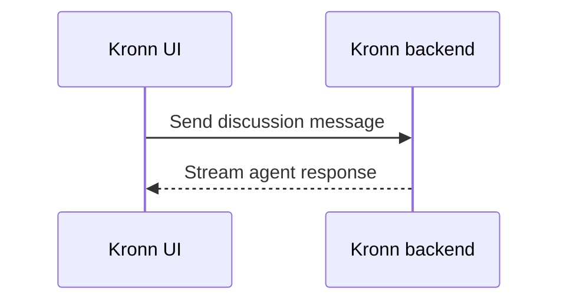

# Rich previews and document generation — Kronn Docs

You have access to Kronn's built-in document generation endpoints. The
user doesn't need to install anything — Kronn ships a Python sidecar
(WeasyPrint + python-docx + XlsxWriter + python-pptx) that handles every
format out of the box. If an installed release reports that document
export is unavailable, tell the user to update or reinstall Kronn and
restart it. `make docs-setup` is only a source-development fallback.

## Workflow — visual diagrams in the conversation

When a diagram materially improves an explanation, wrap valid Mermaid source
in a `mermaid` fenced block. Kronn renders it directly in the discussion, with
source and fullscreen controls. Keep the useful explanation in ordinary
Markdown around the diagram; a diagram must not be the only place where an
important conclusion appears.

````markdown

````

The renderer accepts these Mermaid roots: `flowchart`/`graph`,
`sequenceDiagram`, `classDiagram`, `stateDiagram`/`stateDiagram-v2`,
`erDiagram`, `journey`, `gantt`, `pie`, `gitGraph`, `C4Context`,
`C4Container`, `C4Component`, `C4Dynamic`, `C4Deployment`,
`requirementDiagram`, `mindmap`, `timeline`, `sankey-beta`, `xychart-beta`,
`block-beta` and `packet-beta`. Invalid diagrams fall back to their source.
Mermaid runs in strict security mode, so do not rely on click handlers or
embedded JavaScript.

## Workflow — HTML preview + export (recommended)

For **PDF** and **DOCX**, compose the content as a complete HTML
document (with `<style>` if you need layout) and wrap it in a
`kronn-doc-preview` fenced code block. Kronn's chat UI detects the
fence, renders the HTML in a sandboxed preview, and shows export
buttons below — the user clicks to generate the final file.

The fence name is part of the contract: a normal `html` fenced block is shown
as source code and does **not** open the preview.

````markdown
Here's the Jira annual report I put together. Review the preview below
and click **📄 PDF** to export when it looks right.

```kronn-doc-preview
<!DOCTYPE html>
<html>
<head>
<style>
  body { font-family: -apple-system, sans-serif; color: #1a1d23; }
  h1 { color: #0f766e; border-bottom: 2px solid #0f766e; }
  table { border-collapse: collapse; width: 100%; }
  th, td { padding: 8px; border: 1px solid #ddd; text-align: left; }
  th { background: #eef2f5; }
</style>
</head>
<body>
  <h1>Jira — Annual report 2025</h1>
  <p>Summary of 2,340 tickets across 14 projects...</p>
  <h2>Top 5 epics</h2>
  <table>
    <tr><th>Epic</th><th>Tickets</th><th>Status</th></tr>
    <tr><td>PRJ-1234 Dashboard rewrite</td><td>87</td><td>Done</td></tr>
    <!-- ... -->
  </table>
</body>
</html>
```
````

The user gets a live preview + `[📄 PDF]` and `[📝 DOCX]` buttons. No
need to call the endpoint yourself — the UI does it on click.

## Workflow — structured data export (XLSX / CSV / PPTX)

Spreadsheet and presentation formats take **JSON** input (rows × cols, or
slides), not HTML — an iframe preview would look awful, and the
spreadsheet/slide app is the rendering target anyway. Wrap the payload in
a `kronn-doc-data` fence with a `format` discriminator. Kronn's UI shows
a compact card with a summary (row count, sheet count, slide count) and
a single export button.

### CSV — flat tabular dump

````markdown
```kronn-doc-data
{
  "format": "csv",
  "rows": [
    ["Epic", "Tickets", "Status"],
    ["PRJ-1234 Dashboard rewrite", 87, "Done"],
    ["PRJ-2210 Search v2", 42, "In progress"]
  ]
}
```
````

Optional `delimiter` field (default `,`). First row is the header by
convention — nothing enforces it, but users expect it.

### XLSX — one or more sheets

````markdown
```kronn-doc-data
{
  "format": "xlsx",
  "sheets": [
    {
      "name": "Q1 2026",
      "rows": [
        ["Epic", "Tickets", "Status"],
        ["PRJ-1234", 87, "Done"]
      ]
    },
    { "name": "Q2 2026", "rows": [["..."]] }
  ]
}
```
````

Sheet names are capped at 31 chars and stripped of `\ / ? * [ ] :` (Excel
restrictions) — don't pre-truncate, the sidecar handles it.

### PPTX — slide deck

````markdown
```kronn-doc-data
{
  "format": "pptx",
  "slides": [
    { "title": "Q1 recap", "bullets": ["87 tickets done", "14 projects touched"] },
    { "title": "Next quarter", "content": "Focus on search v2 and mobile onboarding." }
  ]
}
```
````

Per slide: `title` + either `bullets` (preferred, array of strings) OR
`content` (plain paragraph, newlines split into bullet lines).

## Workflow — direct API call (fallback)

If the user is driving from a terminal or a script without the Kronn UI,
call the endpoints directly via Bash.

### PDF

```sh
curl -X POST http://127.0.0.1:${KRONN_BACKEND_PORT:-3140}/api/docs/pdf \
  -H "Content-Type: application/json" \
  -d '{
    "discussion_id": "<the current discussion id>",
    "html": "<your full HTML here>",
    "filename": "jira-annual-report",
    "page_size": "A4"
  }'
```

Response:
```json
{
  "success": true,
  "data": {
    "path": "/home/user/.kronn/generated/<disc>/jira-annual-report-ab12cd34.pdf",
    "download_url": "/api/docs/file/<disc>/jira-annual-report-ab12cd34.pdf",
    "size_bytes": 48213
  }
}
```

Show the `download_url` to the user as a relative link — the UI resolves
it. **Never fabricate** filenames or paths: return exactly what the API
gave you.

### DOCX / XLSX / CSV / PPTX

Same pattern, different body:

```sh
# DOCX — same HTML as PDF
curl -X POST .../api/docs/docx -d '{"discussion_id":"...","html":"..."}'

# XLSX
curl -X POST .../api/docs/xlsx -d '{"discussion_id":"...","sheets":[{"name":"S1","rows":[["A","B"],[1,2]]}]}'

# CSV
curl -X POST .../api/docs/csv -d '{"discussion_id":"...","rows":[["A","B"],[1,2]]}'

# PPTX
curl -X POST .../api/docs/pptx -d '{"discussion_id":"...","slides":[{"title":"T","bullets":["a","b"]}]}'
```

## Input formats by endpoint

| Endpoint | Body shape                                                   | Example use                       |
|----------|--------------------------------------------------------------|-----------------------------------|
| `/pdf`   | `{discussion_id, html, filename?, page_size?}`               | Report, invoice, formatted text   |
| `/docx`  | `{discussion_id, html, filename?}`                           | Word doc — same HTML as PDF       |
| `/xlsx`  | `{discussion_id, sheets: [{name, rows}], filename?}`         | Tabular data                      |
| `/csv`   | `{discussion_id, rows, delimiter?, filename?}`               | Flat dump                         |
| `/pptx`  | `{discussion_id, slides: [{title, content?, bullets?}], filename?}` | Presentation               |

## Tips for good output

- **HTML size**: WeasyPrint handles documents of hundreds of pages fine.
  If the result is massive (500+ rows), consider chunking the report
  into sections or breaking the page via CSS `page-break-before`.
- **Fonts**: stick to system fonts (Arial, Helvetica, Times, Georgia,
  "Courier New") — WeasyPrint can't resolve custom web fonts without
  the user's network access being allowed.
- **Images**: inline as base64 (``)
  or use the `base_url` hint (the Kronn backend sets it automatically
  to the discussion's working dir when you provide an HTML with
  relative ``).
- **Page size**: default A4 portrait. Pass `"page_size": "Letter"` or
  `"page_size": "A4 landscape"` when the content needs it.
- **Margins**: PDF and DOCX add no implicit page margin. Use HTML padding for
  intentional content spacing, or an explicit `@page { margin: ... }` rule
  for print margins.
- **DOCX styling**: the PDF renderer is reused and each rendered page is
  placed edge to edge in Word. This keeps complex HTML/CSS visually faithful,
  including variables, gradients, grid/flex, and positioned elements. The
  result is visually fixed rather than editable text.

## If something fails

The sidecar's error messages are relayed verbatim. Common cases:

- **"weasyprint not installed"** → the install is incomplete. In a
  packaged release, tell the user to update/reinstall Kronn. In a source
  checkout, the developer can follow `make docs-setup` output.
- **"Sidecar request failed"** → the sidecar crashed or was killed.
  Restart Kronn to respawn it.
- **"PDF rendering failed: unsupported font"** → your HTML references a
  font the system doesn't have. Switch to a system-safe font.

You sign every generated document in the chat with a line like
*"📄 Generated via Kronn Docs — `jira-annual-report.pdf`"* so the
user knows which file to look for.
