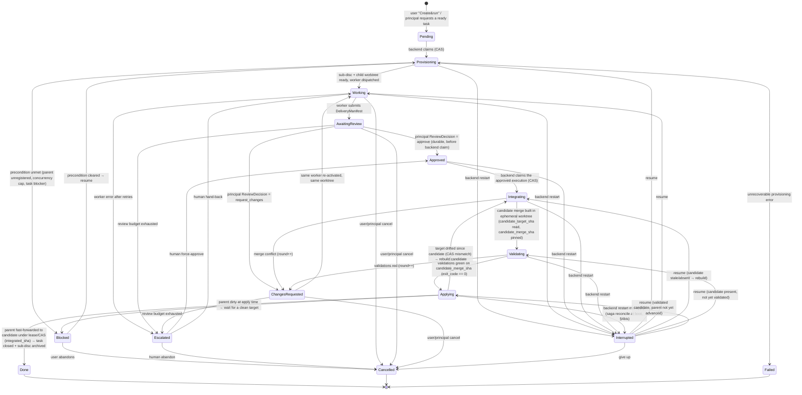

# ADR-002 — Durable multi-agent task orchestration: contract, states and responsibility boundaries

- **Status**: ACCEPTED — corrections verified by Codex (0.11.0 — KT-316).
  Codex's first arbitration (2026-08-16) closed the four draft questions in §9 (runtime object O2,
  two-phase ff-only integration, idempotent saga, dedicated validation table, typed MCP transport). His
  second review reopened two DoD (domain model + state machine); both corrections are now applied in the
  body: `OrchestrationRun` is a **mandatory**, non-null-FK envelope with an implicit `single_task` run
  for a one-task launch (§1, §2, §9.1 — no "optional/degenerate/standalone" wording remains), and the
  state machine materializes the full saga boundary `Approved → Integrating → Validating → Applying`
  plus a non-terminal `Blocked` (§3, §4bis). Codex's final verification accepted these corrections;
  KT-316 is complete and KT-317 may proceed after its dedicated workspace is declared. Romuald
  (product owner) review welcome, not blocking.
- **Date**: 2026-08-16
- **Deciders**: Claude (author), Codex (co-design + arbitration), Romuald (product owner)
- **Scope**: KT-315 (objective), KT-316 (this ADR). Downstream: KT-317…KT-326.
- **Upstream context**: `planning-and-discussion-plans.md` slice 7 ("Deferred delegation —
  task-to-discussion briefing and agent launch only after the task workflow is proven
  manually") `[src: file: docs/design/planning-and-discussion-plans.md:217-219]` and the
  "Create only / Create and run" delegation decision
  `[src: file: docs/design/planning-and-discussion-plans.md:196-198]`. This ADR turns that
  deferred flow into a durable, backend-owned lifecycle.

---

## 0. Audit — what is reused, adapted, created (DoD-0)

Five parallel audits covered planning, workspaces/worktrees/Git, dispatch/sessions,
the workflow run engine, and agent profiles/MCP surface. The consolidated finding:
**Kronn already owns every hard, durable primitive this feature needs — a state
machine with sticky transitions, a crash-safe worker dispatcher, a parent/child run
tree, a Human Gate, and worktree teardown — but none of them is task-scoped, and there
is no server-side Git integration and no structured worker deliverable.** The work is
composition and one genuinely new capability (protected merge), not reinvention.

### Reuse as-is

| Capability | Where | Note |
|---|---|---|
| Durable run row + status enum + compile-locked `is_terminal()` | `models/workflows.rs:1248-1281`, `db/sql/003_workflows.sql:25-39` | The state-machine template. |
| Sticky state-machine writes (guarded snapshot + CAS claim family) | `db/workflows.rs:1425-1541` | "Arbitration lives in the SQL predicate, not the mutex" — [ADR-001](adr-001-db-connection-model.md). |
| Boot reconcile Running/Pending→`Interrupted` + failure webhook | `db/workflows.rs:91-123`, `db/mod.rs:167-178`, `main.rs:248-257` | Terminal, **not** auto-resume. |
| Manual/CAS resume (Interrupted→Running, cursor after last step) | `runner.rs:2827-2873` | |
| Cancellation tree + "Cancelled is sticky" | `workflows/cancellation.rs:28-110`, guard `db/workflows.rs:1508-1541` | |
| Human Gate: pause→decide (Approve/RequestChanges/Reject) + feedback injection + auto-approve-after-secs + pre-gate git checkpoint | `workflows/gate_step.rs:33-95`, `runner.rs:2468-2564`, `api/workflows.rs:3049-3150` | The review-decision plumbing already exists. |
| Durable worker dispatch: idempotent enqueue, atomic single-flight claim (one-Running-per-disc), restart recovery, group concurrency | `db/agent_dispatch.rs:44-70,185-223,404-469`, dispatcher `api/discussions/runtime.rs:111-172` | The worker-launch primitive. |
| Fan-out precedent: N child discussions bound to a parent run, each with its own agent/persona/tier/model | `db/workflows.rs:560-647`, `workflows/batch_step.rs:453-478` | Closest end-to-end template. |
| Parent/child run tree + `SharedBudget` (tree-wide token quota) + depth cap + per-run worktree + `produced_branches` | `db/sql/030_workflow_run_parent.sql`, `workflows/sub_workflow_step.rs:118-204`, `runner.rs:164-170`, `db/sql/046_workflow_run_produced_branches.sql:19` | |
| Schema-validated agent output (`TypedSchema`/`OnInvalid::Fail`) + gated typed-decision persistence | `models/workflows.rs:212-247`, `workflows/triage.rs:47-119`, `models/agent_decisions.rs:14-77` | The DeliveryManifest + review-verdict template. |
| Durable human-gated proposal system (ingest→accept, idempotent, atomic apply+receipt) | `db/planning_proposals.rs:358-408,811-873,935-1110`, schema `087/088` | Template for a human-only accept surface. |
| Server-side branch/HEAD read + canonicalization + repo-scope/registration validation | `api/disc_workspace.rs:105-233` | |
| Detached worktree pinned at a base SHA | `api/workflows.rs:3611-3626` | Pins a SHA; creates **no** named branch. |
| Worktree teardown / branch-preservation / dirty-check | `core/worktree.rs:447-501,619-633`, `workflows/workspace.rs:118-163,314-384` | |
| Advisory history-rewrite lease (TTL, arbitration, backup-ref proof) | `api/disc_workspace.rs:463-637`, `db/discussion_workspaces.rs:223-324` | |
| Worktree-targeted commit / push / PR | `api/git_ops.rs:922-1020,1036-1112,1235-1316`, dispatch `api/disc_git.rs:30-107` | |
| Typed identities (`DiscussionAgent`/`Agent`/`Cli`) + deterministic routing | `models/discussions.rs:436-453`, `api/discussions/routing.rs:8-64` | Never Markdown-derived. |
| Per-discussion binding of profile/skill/directive + tier/model | `models/discussions.rs:56-60,73-80`, prompt assembly `core/static_context.rs:94-171` | The "specialized worker" bundle. |
| In-discussion "worker hands back to the room's principal" wake | `api/disc_source.rs:733-746`, `api/discussions/routing.rs:48-64` | Intra-discussion only. |

### Adapt

| Item | Where | Adaptation |
|---|---|---|
| `run_type` discriminator (`linear\|batch\|subworkflow`) | `db/sql/028_batch_workflow_runs.sql:13`, `models/workflows.rs:1174-1177` | Considered as an extension point for `task` — **rejected**, see §3. |
| Managed-worktree creator (branch-name based) | `core/worktree.rs:179-249` | Must accept `git worktree add -b <child> <path> <base_sha>` (SHA arg, not branch name). |
| `head_sha` snapshot column (inert for lineage) | `db/sql/101_discussion_workspaces.sql:17` | Becomes the pinned base for a child. |
| "Ahead of base" preservation check | `workflows/workspace.rs:118-163` | Becomes the merge-eligibility gate. |
| `disc_create` / `disc_create_room` MCP tools | `disc-introspection-mcp.py:537-559,958-995` | Extend to accept `profile_ids/skill_ids/directive_ids/model` (already HTTP-side at `models/discussions.rs:355-366`) so a worker can be spawned bound. |
| `actor_kind` CHECK (`human`,`agent` only) | `db/sql/081_planning_tasks.sql:92` | Add a `backend`/`system` actor so autonomous transitions are attributable. |
| `triage_manifest_schema` + `AgentDecision` gate lifecycle | `workflows/triage.rs:47-119`, `models/agent_decisions.rs:53-77` | Generalize from run-scope to a discussion/task-scoped DeliveryManifest + review verdict. |
| Batch completion hook (settles a workflow run) | `api/discussions/runtime.rs:76-105` | Add a branch that appends the deliverable into the **parent discussion** and wakes its agent. |

### Create (net-new)

1. **`task_executions` durable object** — task-scoped run aggregate (§2). No `task_id` exists on
   `workflow_runs` `[src: file: db/sql/003_workflows.sql:25]`; planning tasks have **no runtime
   execution record** at all (only 9 plan-structure FKs + the optional
   `discussion_workspaces.task_id` `[src: file: db/sql/101_discussion_workspaces.sql:26]`).
2. **Parent-discussion → child-sub-discussion relation** — none exists; a discussion carries only
   `workflow_run_id` and task links `[src: file: api/discussions/crud.rs:284]`.
3. **Cross-discussion wake** — deliver a child worker's result into the parent discussion and wake
   the parent agent. `notify_one` is process-global, not parent-scoped
   `[src: file: api/discussions/runtime.rs:246]`; the only cross-object completion path today
   settles a workflow run, not a conversational agent.
4. **Server-side Git integration** — no `merge`/`rebase`/`cherry-pick`/`format-patch`/`am`/`update-ref`
   anywhere in `backend/src`; merge/rebase are explicitly denied
   `[src: file: api/git_ops.rs:1152-1160]`. Conflict detection + validation gate + cleanup for
   merge-back must be built from scratch.
5. **Versioned Brief + DeliveryManifest + ReviewDecision contracts** — everything at the discussion
   layer is Markdown today; the only structured, persisted message payload is `kronn-plan-action`.
6. **Child worktree pinned at a base SHA + lineage columns** — the schema has no parent/base-SHA/lineage
   columns `[src: file: db/sql/101_discussion_workspaces.sql:8-28]`.

---

## 1. Domain model (DoD-1)

Five distinct concepts, deliberately not collapsed:

- **Plan (durable, source of truth)** — `planning_tasks`. Unchanged. A task remains globally
  addressable (`KT-xxx`), carries status/priority/DoD/blockers, and is the **only** authority on
  whether the work is done. Execution never mutates the task except through the same audited,
  proposal-or-direct write paths agents already use.
- **`OrchestrationRun` (mandatory campaign envelope — Codex 2026-08-16)** — one principal-agent
  campaign of driving a plan. It owns the common policy: parent discussion / principal, eligible tasks,
  target workspace + branch, shared token budget, concurrency limit, `max_review_rounds`, integration
  strategy and validations. **V1 keeps it thin but never absent**: every `TaskExecution` carries a
  **non-null `orchestration_run_id` FK**, and a single-task "Create and run" **auto-creates an implicit
  `single_task` OrchestrationRun**. This deliberately avoids standalone/nullable rows that KT-321
  (coordination) would otherwise have to reinterpret; the same row is the home for future DAG
  parallelism.
- **`TaskExecution` (the unit of work)** — one task → one worker → one sub-discussion → one worktree
  → review → integration. This is the new durable aggregate that owns the lifecycle. Exactly one
  **active** `TaskExecution` per task in V1.
- **Sub-discussion (execution space)** — a child discussion bound to the task and to the parent
  discussion. It is where the worker reads its brief, works, and posts its DeliveryManifest. It is
  archived on `Done`. It is *not* the source of truth — the task is.
- **Workspace / worktree (execution substrate)** — a managed child git worktree, pinned at a base
  SHA taken from the parent discussion's declared workspace, on an explicit child branch.

```
planning_task (KT-142, source of truth)
   └─1:N─ TaskExecution (durable run aggregate, non-null orchestration_run_id)
             ├── parented by ──▶ OrchestrationRun (mandatory; single_task auto-created for a one-task launch)
             ├─1:1─ sub-discussion (execution space, archived on Done)
             ├─1:1─ child worktree  (base_sha pinned, branch kronn/task/KT-142)
             ├─1:1─ worker dispatch (agent_dispatch_jobs, one-Running invariant)
             └─1:N─ DeliveryManifest / ReviewDecision (versioned, journaled)
```

The task↔sub-discussion binding reuses `planning_task_discussions`
`[src: file: db/sql/081_planning_tasks.sql:32-46]`; the parent↔child discussion edge and the
`task_execution_id` back-reference are net-new.

---

## 2. Central architectural decision — reuse the engine, or a distinct object?

This is the one decision that needs sign-off before KT-317.

### O1 — Extend `workflow_runs` with `run_type = "task"`
Add a `task` variant to the run-type discriminator and drive a TaskExecution through the existing
`execute_run` engine.
- ✅ Inherits the sticky state machine, reconcile, cancellation tree, Gate, SharedBudget and worktree
  tree wholesale, with zero duplication.
- ❌ `execute_run` is a **step-graph interpreter over `steps_json`**; a TaskExecution has no step
  graph — it is a two-agent review loop across two discussions. Modelling it as a run forces a fake
  single-step graph and pushes discussion-wake concerns into an engine that has none today (the
  cross-disc agent wake is genuinely absent, `api/discussions/runtime.rs:76-105`).
- ❌ `workflow_runs` has no `task_id`; `discussions.workflow_run_id` is the *child-disc→run* edge,
  the inverse of the *child-disc→parent-agent* wake we need.
- ❌ Couples the plan-execution lifecycle to the workflow engine's release cadence and its
  step/envelope semantics forever.

### O2 — Distinct `task_executions` aggregate that reuses the proven *patterns* and *primitives* (recommended)
A new task-scoped table and a small dedicated driver. It **borrows the hard-won invariants** rather
than inheriting the executor:
- sticky, SQL-predicate transition writes (the ADR-001 lesson) and a compile-locked `is_terminal()`;
- boot reconcile of non-terminal rows → `Interrupted` + failure webhook;
- `Cancelled`-sticky cancellation;
- the Gate decide-loop (Approve/RequestChanges/Reject) as the review mechanism;
and it **composes the primitives directly**: `agent_dispatch_jobs` to launch the worker,
`SharedBudget` for the token quota, the worktree teardown helpers for cleanup.
- ✅ The task stays the single source of truth; the TaskExecution is its cleanly separable, archivable
  execution shadow.
- ✅ Discussion-native from day one — no impedance mismatch with the step-graph engine.
- ✅ The genuinely-new capabilities (cross-disc wake, protected merge, DeliveryManifest) live in one
  focused module instead of leaking into the workflow engine.
- ❌ Some scaffolding is duplicated (a second reconcile path, a second cancellation entry point).
  **Mitigation**: extract the sticky-write predicate, the reconcile query shape, and the terminal-lock
  helper into a shared `run_state` primitive both engines call, so the *invariant* has one home even
  though there are two aggregates.

### O3 — Pure agent-layer orchestration (no new backend object)
The principal agent drives everything through existing MCP tools.
- ✅ Zero new durable object.
- ❌ Violates the load-bearing invariant "the backend owns lifecycle, statuses, crash recovery and
  cleanup." An agent-driven loop dies with the agent process: no reconcile, no sticky transitions, no
  protected merge, no bounded review budget enforced server-side. This is precisely the manual flow
  the design said to *replace* once proven. **Rejected.**

### Decision (locked — Codex 2026-08-16)
**Adopt O2.** Build `task_executions` as a distinct durable aggregate, extract the shared state-machine
invariant into a `run_state` helper reused by both the workflow engine and this aggregate, and compose
the existing dispatch/Gate/worktree/budget primitives. Note O1 as the explicitly-rejected alternative
so the choice is auditable. A **mandatory**, deliberately-thin `OrchestrationRun` envelope parents
every `TaskExecution` (non-null FK) and carries the tree-wide budget / concurrency / eligible-tasks /
target / `max_review_rounds` / integration-strategy policy; a single-task "Create and run" auto-creates
an implicit `single_task` run so there are never standalone/nullable rows to reinterpret in KT-321
(see §1). We reuse/extract the Gate decide-loop, `TypedSchema` and dispatch primitives; we never
repurpose `WorkflowRun`.

---

## 3. State machine, transitions and owners (DoD-2, DoD-3)



**Durable-state semantics** (the checkpoints that make crash-safety §4bis work):

- `Approved` is written **before** the backend claims integration — mirroring `Pending`→`Provisioning`.
  The principal's approve verdict is durable, so a restart between "approved" and "integration claimed"
  loses nothing and resumes cleanly. Every path into `Integrating` goes through `Approved`, including a
  human force-approve out of `Escalated`.
- `Validating` carries `candidate_target_sha` (the parent tip the candidate was built on) and
  `candidate_merge_sha` (the exact commit under test), plus its validation runs. Validations execute on
  that pinned commit, **before** the parent is touched (§4bis, §6).
- `Applying` is persisted **before** any mutation of the parent ref — the durable "intent to advance"
  marker the boot saga reconciles against the real Git refs (§4bis).
- `Blocked` is a **non-terminal** hold on an unmet external precondition (parent workspace unregistered
  at provisioning **or** parent dirty at apply time, concurrency cap reached, unsatisfied task blocker).
  It clears back to the state it left, or a human cancels it. It is distinct from `Escalated` (a human
  *review* decision) and from
  `Interrupted` (a crash reconcile target).
- `Interrupted` is **quiescent and resumable**, never a business outcome. Only `Done`, `Cancelled`,
  `Failed` are terminal and **sticky** — a late/zombie worker snapshot can never resurrect them (same
  guard shape as `db/workflows.rs:1508-1541`).

**Owner of each transition** (who is authorized to trigger it):

| Transition | Owner |
|---|---|
| create → `Pending` | **User** ("Create and run") or **principal agent** (requests a *ready, actionable* task) |
| `Pending` → `Provisioning` | **Backend** (CAS claim) |
| `Provisioning` → `Working` | **Backend** (provisions worktree + sub-disc, dispatches worker) |
| `Provisioning` → `Blocked` / `Failed` | **Backend** (unmet precondition / unrecoverable error) |
| `Blocked` → `Provisioning` | **Backend** (precondition cleared) |
| `Working` → `AwaitingReview` (submit DeliveryManifest) | **Worker** |
| `AwaitingReview` → `Approved` / `ChangesRequested` (ReviewDecision) | **Principal agent** (within the review budget) |
| `Approved` → `Integrating` | **Backend** (CAS claim of the approved execution) |
| `ChangesRequested` → `Working` (re-activate) | **Backend** (re-dispatch), worker resumes |
| `Integrating` → `Validating` (build candidate) / `ChangesRequested` (merge conflict) | **Backend** — never an agent |
| `Validating` → `Applying` / `ChangesRequested` (validation verdict) | **Backend** — `exit_code` is the verdict |
| `Applying` → `Done` (ff-only + close) / `Integrating` (drift) / `Blocked` (dirty target) | **Backend** — never an agent |
| any non-terminal → `Escalated` (budget/hard-fail) | **Backend** (enforces the limit) |
| `Escalated` → force-approve (`Approved`) / hand-back (`Working`) / abandon (`Cancelled`) | **User** (human gate) |
| any non-terminal → `Cancelled` | **User** or **principal agent** |
| non-terminal → `Interrupted` → guarded resume | **Backend** (boot reconcile / explicit resume) |

The worker **never** closes its own task, **never** merges, and **never** approves its own delivery —
mirroring the human-only proposal-accept boundary `[src: file: disc-introspection-mcp.py:311-314]`.
Every transition is journaled with an attributed actor (requires the new `backend`/`system` actor kind,
§0-Adapt).

---

## 4. Git targeting contract (DoD-4)

Integration is only ever toward an **explicitly pinned** target. No implicit branch, ever.

- **Workspace** — the parent discussion's declared workspace (`canonical_path` + `project`), validated
  by the existing repo-scope/registration checks `[src: file: api/disc_workspace.rs:105-233]`. The
  parent workspace must be **registered** (a resolvable project repo) before a TaskExecution can start.
  Cleanliness is **not** a provisioning precondition for a native launch: the base SHA is pinned from a
  committed rev (next bullet) and the child runs in an isolated sibling worktree, fully decoupled from
  the parent's working tree. Parent cleanliness is enforced only at **apply time** (§4bis, KT-320),
  where the guarded fast-forward CAS requires a clean target — refusing to launch on a transiently
  dirty parent would be a false barrier (the pin is already a clean commit) that blocks every launch
  while the human has uncommitted edits in the main checkout.
- **Base SHA** — the target rev resolved server-side at provisioning to a **committed** SHA
  (`resolve_commit`, default the parent workspace's target branch tip,
  `[src: file: core/worktree.rs:578]`) and **pinned** into `task_executions.base_sha`. The child is
  created from this exact SHA, not from a moving branch tip — and never from a dirty working tree,
  which is precisely why parent cleanliness is an apply-time concern, not a provisioning one. HEAD of
  the fresh child is verified to equal `base_sha` after creation
  (`verify_worktree_head`, `[src: file: core/worktree.rs:597]`).
- **Child branch + worktree** — a managed worktree under `.kronn/worktrees/`, created with
  `git worktree add -b kronn/task/<KT-ref>-<exec-short> <path> <base_sha>` (the SHA-arg variant the
  managed creator must gain, §0-Adapt). The branch carries a short **execution** id, not a review
  **round** (the earlier `[-r<round>]` form is superseded — it collides when the same task is
  re-executed; the execution id is collision-free, and KT-320 teardown derives the branch from the
  execution, never the round). Lineage columns (`parent_discussion_id`, `base_sha`,
  `task_execution_id`) are recorded on the workspace row.
- **Integration target** — the parent workspace's **branch, named explicitly** on the TaskExecution.
  The backend refuses to integrate into any branch other than that pinned target, and never into an
  implicit or inferred branch.
- **Integration mechanism (locked — Codex 2026-08-16): two-phase, never a speculative merge into the
  live parent, never merge-in-place.** Merge/rebase is a new server-side capability (currently denied,
  `[src: file: api/git_ops.rs:1152-1160]`). The final mutation of the parent is a **fast-forward only**
  to an already-validated commit:
  1. **Build phase — ephemeral integration worktree.** Read the parent target tip server-side and pin
     it as `candidate_target_sha` (distinct from the child's `base_sha`, which may be older). Create a
     throwaway integration worktree/branch at `candidate_target_sha` (reusing the managed-worktree
     creator + teardown, `[src: file: core/worktree.rs:447-501]`). Merge the child branch there
     (`--no-ff`); a conflict ends the phase → nothing is touched on the parent, the round is handed
     back to the worker with the conflict as feedback (matches "échec de merge → rien n'est clôturé,
     le worker est réactivé"). The successful merge commit is the **candidate** — pin its SHA as
     `candidate_merge_sha`.
  2. **Validate in place** on that exact candidate commit (§4bis + §6) before the parent is touched at
     all.
  3. **Apply phase — guarded fast-forward.** Acquire the advisory history lease and write a mandatory
     `refs/kronn-backup/<KT-ref>` at the current parent HEAD
     `[src: file: api/disc_workspace.rs:463-637]`. Verify under lease that the parent tip is **still
     exactly `candidate_target_sha`** (a compare-and-swap) and that the parent worktree is **clean**.
  4. Advance the parent to `candidate_merge_sha` **fast-forward only** — a deterministic, short,
     verifiable mutation (the candidate already contains `candidate_target_sha` as an ancestor).
  5. **Never** `stash`, and **never** silently `update-ref` a checked-out branch. If the parent has
     drifted (tip ≠ `candidate_target_sha`) or is dirty, the apply is refused: the integration is
     rebuilt on the new tip (→ `Integrating`), never forced through.
- **Cleanup** — on `Done`, the child worktree is torn down
  (`remove_discussion_worktree`, `[src: file: core/worktree.rs:447-501]`) and the sub-discussion
  archived. On `Cancelled`/`Failed`, the child branch is preserved for inspection and the worktree
  removed only if clean.

---

## 4bis. Integration is an idempotent saga, not a transaction (DoD-2, crash invariant)

**"merge + tests + DB close, atomically" is impossible** — Git is an external effect outside the SQLite
transaction boundary. A backend restart can land between the parent ref moving and the task closing, or
between the candidate being built and the parent advancing. V1 therefore models integration as an
**idempotent saga** whose durable checkpoints are compared against the *real* Git refs at boot, exactly
as `workflow_runs` reconciles non-terminal rows against reality `[src: file: db/workflows.rs:91-123]`.

Durable columns on `task_executions` that make each step replay-safe:
`candidate_target_sha` (parent tip the candidate was built on), `candidate_merge_sha` (validated
candidate), `integrated_sha` (what the parent actually became), `backup_ref`, and the
`Integrating`/`Validating`/`Applying` sub-state.

Ordered, each step re-entrant, one durable state per step:

1. **`Integrating`** — read the parent target tip, persist `candidate_target_sha`; build the candidate
   merge in the ephemeral worktree, persist `candidate_merge_sha`.
2. **`Validating`** — run validations on the exact `candidate_merge_sha`; record each verdict in
   `task_execution_validation_runs` (§6). Any red run → `ChangesRequested` (round++), nothing else moves.
3. **`Applying`** — entered and persisted **before** any parent mutation. This is the durable "intent to
   advance" marker.
4. Under lease + `backup_ref`, CAS the parent (tip == `candidate_target_sha`, clean) → fast-forward →
   persist `integrated_sha`.
5. **Only then** close the task and archive the sub-discussion.

**Boot reconciliation** for a row found in `Integrating`/`Validating`/`Applying` (never auto-resumed
silently — it lands in `Interrupted` first, then a guarded resume compares the durable checkpoint to the
real ref):

| Durable state at boot | Real parent tip | Meaning | Action |
|---|---|---|---|
| `Integrating`, `candidate_merge_sha` null | any | candidate not built | re-read tip → rebuild candidate |
| `Validating`, `candidate_merge_sha` set | tip == `candidate_target_sha` | candidate valid, verdict incomplete | re-run validations on `candidate_merge_sha` |
| `Validating`/`Applying`, `candidate_merge_sha` set | tip ∉ {`candidate_target_sha`, `candidate_merge_sha`} | parent drifted | rebuild candidate (→ `Integrating`) |
| `Applying`, `integrated_sha` null | tip == `candidate_target_sha` (clean) | apply never happened | replay step 4 |
| `Applying`, `integrated_sha` null | tip == `candidate_target_sha` (dirty) | parent dirty | → `Blocked` until clean |
| `Applying`, `integrated_sha` null | tip == `candidate_merge_sha` | apply landed, close didn't | skip to step 5 (idempotent close → `Done`) |
| `Done`, `integrated_sha` set | tip == `integrated_sha` | fully applied | no-op |

The CAS on `candidate_target_sha` under the advisory lease is what makes step 4 safe to replay: a second
attempt either finds the parent already at `candidate_merge_sha` (idempotent no-op → close) or refuses
because the parent moved (→ rebuild) or is dirty (→ `Blocked`). No step ever stashes, force-moves a
checked-out branch, or closes a task before `integrated_sha` is durably recorded.

The implemented recovery layer makes that decision durable rather than recomputing it after every
restart. Boot first quiesces due dispatches and moves non-terminal executions to `Interrupted` in the
same SQLite boundary, then classifies the checkpoint against discussions, worker availability,
workspace ownership and the real Git refs. A pending decision survives a second crash and is consumed
only by an explicit guarded resume `[src: file: api/orchestration.rs:146-332]`
`[src: file: db/orchestration.rs:2865-3229]`. The runtime watchdog uses four independent clocks — total
duration, activity, review wait and human wait — so an acknowledged human gate is never mistaken for a
dead worker `[src: file: api/orchestration.rs:334-414]`.

Cancellation and reassignment preserve the same lineage. Cancellation first cancels live processes and
due dispatches, then applies the persisted cleanup policy; `remove_if_clean` removes only the proven
managed checkout and preserves its branch. Reassignment keeps the task, sub-discussion, worktree,
manifests, findings and SHAs while recording the exact typed worker identity and assignment generation
`[src: file: api/orchestration.rs:4228-4453]` `[src: file: db/orchestration.rs:3273-3450]`. Boot also
collects `managed` workspace rows orphaned by `ON DELETE SET NULL`; dirty or unverifiable worktrees are
left visible for human action rather than silently deleted `[src: file: api/orchestration.rs:235-330]`
`[src: file: db/discussion_workspaces.rs:383-406]`.

---

## 5. Versioned contracts: Brief, DeliveryManifest, ReviewDecision (DoD-5)

All three are versioned (`"version": "1"`) and validated with the existing `TypedSchema` /
`OnInvalid::Fail` machinery `[src: file: models/workflows.rs:212-247]`, following the
`triage_manifest_schema` precedent `[src: file: workflows/triage.rs:47-119]`. They are persisted like
`kronn-plan-action` (fence parse + durable row) and each carries a gate lifecycle modelled on
`AgentDecision.gate_status` `[src: file: models/agent_decisions.rs:53-77]`.

**Brief v1** (backend → worker, immutable per attempt, frozen into the sub-discussion's
`pin_first_message` `[src: file: models/discussions.rs:81-84]`):
```json
{ "version":"1", "task_ref":"KT-142", "objective":"<task description>",
  "definition_of_done":[{"dod_id":"…","sentence":"…"}],
  "workspace":"<canonical_path>", "branch":"kronn/task/KT-142", "base_sha":"<40-hex>",
  "constraints":["no force-push","stay within scope"], "review_budget":3 }
```

**DeliveryManifest v1** (worker → backend/principal, submitted via a new `task_exec_deliver` MCP tool
and/or a `kronn-delivery` fence):
```json
{ "version":"1", "task_ref":"KT-142", "head_sha":"<40-hex>",
  "files_touched":[{"path":"…","kind":"added|modified|deleted"}],
  "tests":[{"name":"…","status":"pass|fail|skipped","evidence":"path:line or cmd"}],
  "dod_status":[{"dod_id":"…","met":true,"evidence":"path:line"}],
  "docs":["…"], "risks":["…"], "summary":"…" }
```

**ReviewDecision v1** (principal → backend, via a new `task_exec_review` MCP tool; reuses the
`GateDecision` enum semantics `[src: file: api/workflows.rs:3120-3145]`):
```json
{ "version":"1", "task_ref":"KT-142", "decision":"approve|request_changes",
  "comment":"<required when request_changes>",
  "findings":[{"path":"…","line":123,"issue":"…"}] }
```

Rationale for a typed contract over prose: the review loop and the merge gate must both be
machine-checkable (DoD coverage, test status, head SHA), and the whole point of 0.11.0 is a durable,
attributable handoff — "typed assignments and handoffs, never dependent on Markdown mentions alone."

---

## 6. Authorization, review limits, budgets, concurrency, escalation (DoD-6)

- **Authorization (action-level, not tool-allowlist)** — no per-agent tool-authorization model exists
  today `[src: file: core/audit_mcp_filter.rs:33-38]` and building one is out of scope. V1 enforces
  authorization at the **action** boundary. A joined CLI worker is identified by its exact durable
  session, while a native HTTP worker is identified by the trusted executor's child discussion plus
  exact typed provider; model arguments carry neither identity. Principal review/cancel/reassign are
  restricted to the parent discussion. Merge and task-close are **backend-only** and unreachable by
  any agent tool. This mirrors the existing human-only proposal-accept boundary.
- **Review limit** — `max_review_rounds` (configurable, default 3). Merge failures and
  request_changes both increment the round counter. On exhaustion → `Escalated`.
- **Validation substrate (locked — Codex 2026-08-16)** — validations run on the exact
  `candidate_merge_sha` in the integration worktree (§4bis, step 2), reusing the Quick Exec
  **executor, allowlist, timeout and result shape** — but **not** the `quick_exec_runs` table itself,
  so orchestration validations never pollute the QE ROI/history stream
  `[src: file: db/sql/119_quick_exec_runs.sql:18-50]`. A dedicated `task_execution_validation_runs`
  table (`task_execution_id`, `candidate_merge_sha`, `command`, `exit_code`, `duration_ms`, `output`,
  and a **nullable `quick_exec_id`** set when the validation is sourced from a saved Quick Exec) records
  each run; the `exit_code` **is** the pass/fail verdict — this closes the "exit 0 always"
  gap `[src: file: workflows/big_ticket_template.rs:709]`. Any red validation blocks the apply phase:
  nothing is closed, the round is handed back to the worker. (The generic `owner_kind/owner_id` run
  table that would let QE and TaskExecution share one substrate is noted as a future consolidation,
  out of V1 scope.)
- **Budget** — reuse `SharedBudget` (tree-wide token quota, `[src: file: runner.rs:164-170]`) spanning
  the TaskExecution and its worker; exhaustion → `Escalated`, not a silent stop.
- **Concurrency** — one active TaskExecution per task (a partial-unique index, like the one-primary and
  one-live-session invariants). Across a parent discussion / OrchestrationRun, a configurable
  `max_concurrent_executions`, enforced via the `agent_dispatch_jobs` `group_id` concurrency limit
  `[src: file: db/agent_dispatch.rs:431-440]`.
- **Human escalation** — `Escalated` surfaces a Human Gate in the parent discussion (reuse the gate
  decide endpoint `[src: file: api/workflows.rs:3049-3150]`): the user force-approves (→ `Integrating`),
  hands back with guidance (→ `Working`), or abandons (→ `Cancelled`). An optional
  `escalation_notify_url` reuses the gate webhook `[src: file: runner.rs:1893-1937]`.

---

## 7. Non-goals for V1 (DoD-7)

Explicitly deferred, to keep V1 = *one task → one worker → one sub-discussion → one worktree → review
→ integration*:

1. **Intelligent DAG parallelization** — multiple workers advancing the dependency graph concurrently.
   V1 runs one worker per task; the coordinator (KT-321) picks *ready, actionable* tasks one at a time.
2. **Advanced conflict prediction / auto-resolution** — V1 detects a conflict at merge time and hands
   it back to the worker; it does not predict or auto-resolve.
3. **Automatic worker/agent selection** — the worker (provider + profile/skill + tier/model) is chosen
   explicitly at launch. Auto-selection is KT-324+ territory.
4. **Parallel run fan-out with isolated worktrees + sequential-rebase merge** (`BatchWorkflow`) —
   remains designed-only `[src: file: docs/design/recursive-subworkflows.md:51-55]`.
5. **Gate nested inside the worker's own sub-run** — kept out of the worker; the review gate lives at
   the TaskExecution boundary, not inside the worker's turn.

---

## 8. Consequences and downstream mapping

- **New durable objects** `orchestration_runs` (mandatory campaign envelope: policy + budget +
  concurrency + `max_review_rounds` + integration strategy; `single_task` kind auto-created for a
  one-task launch) and `task_executions` (non-null `orchestration_run_id` FK; incl. saga columns
  `candidate_target_sha`, `candidate_merge_sha`, `integrated_sha`, `backup_ref`, `review_rounds`,
  `max_review_rounds`) + lineage columns on `discussion_workspaces` + a
  `parent_discussion_id`/`task_execution_id` edge → **KT-317**.
- **Managed child-worktree-off-SHA + sub-discussion provisioning + worker dispatch** (adapt
  `create_discussion_worktree`, extend `disc_create` MCP binding, seed the trigger message) → **KT-318**.
- **Brief/DeliveryManifest/ReviewDecision contracts + cross-discussion wake + review loop** → **KT-319**.
- **Two-phase protected integration** (ephemeral integration worktree, `task_execution_validation_runs`,
  guarded ff-only apply, idempotent saga §4bis, cleanup) — the one net-new Git capability → **KT-320**.
- **Coordinator / ready-task selection / policies** (`OrchestrationRun`) → **KT-321**.
- **Reconcile of the TaskExecution tree at boot (incl. the §4bis integration-saga reconciliation),
  explicit resume/cancel/reassign, independent timeout clocks and orphan-managed-workspace collection**
  is implemented by **KT-322** `[src: file: api/orchestration.rs:146-414]`
  `[src: file: api/orchestration.rs:4031-4453]`.
- **Actor-kind schema change** (`backend`/`system`) is a shared prerequisite, surfaced in KT-317.
- The ADR began as a decision record; KT-317–KT-322 now implement its durable aggregate,
  provisioning, review, protected integration, coordination and recovery boundaries.

## 9. Decisions closed (arbitrated 2026-08-16 — no open question remains before KT-317)

1. **Runtime object — O2, decided.** A distinct `task_executions` aggregate with an extracted shared
   `run_state` helper; **not** folded into `workflow_runs` as `run_type="task"`. A **mandatory** thin
   `OrchestrationRun` envelope parents every `TaskExecution` (non-null FK); a single-task launch
   auto-creates an implicit `single_task` run — no standalone/nullable rows (§1, §2).
2. **Integration strategy — two-phase, ff-only, decided.** Neither a speculative merge into the live
   parent nor merge-in-place: build + validate a candidate in an ephemeral integration worktree, then
   advance the parent **fast-forward only** under lease + `backup_ref` + CAS on `candidate_target_sha`
   (§4). No `stash`, no silent `update-ref` of a checked-out branch.
3. **Crash safety — idempotent saga, decided.** "merge + tests + close" is not one transaction; it is
   the durable-checkpoint saga of §4bis, reconciled against the real Git refs at boot.
4. **Validation substrate — dedicated `task_execution_validation_runs`, decided.** Reuse the Quick Exec
   executor / allowlist / timeout / result shape, but a dedicated table with an optional `quick_exec_id`
   when a validation is sourced from a saved QE; `exit_code` is the verdict (§6). The generic
   `owner_kind/owner_id` shared run table is deferred **for task-execution validation runs specifically**.
   A narrower, purpose-built `shared_runs` table (`kind` ∈ QuickPrompt/QuickApi/QuickExec/Workflow,
   `source_id`, optional `project_id`/`discussion_id`) now exists for the user-facing run status card
   (KT-243, `backend/src/db/sql/155_shared_runs.sql`) — it is a display/rehydration projection for
   QP/QA/QE/Workflow runs, not a replacement for the task-execution validation substrate decided above.
5. **DeliveryManifest / ReviewDecision transport — decided.** Primary path is a dedicated, typed,
   attributable MCP tool (`task_exec_deliver` / `task_exec_review`); a `kronn-delivery` /
   `kronn-review` fence parsed like `kronn-plan-action` is the fallback for non-MCP runtimes (§5).

With these five closed, the ADR carries no open decision. KT-316's eight DoD are addressed in
§0–§7 respectively; final sign-off by Codex + Romuald flips KT-316 `done` and unblocks KT-317.

---

*Audited primitives: planning `db/planning.rs` · workspaces/Git `api/disc_workspace.rs`,
`core/worktree.rs`, `api/git_ops.rs` · dispatch/sessions `db/agent_dispatch.rs`,
`api/discussions/runtime.rs` · run engine `models/workflows.rs`, `runner.rs`,
`workflows/gate_step.rs` · agents/MCP `models/agents.rs`, `backend/scripts/disc-introspection-mcp.py`.
All citations verified against the tree at audit time.*
