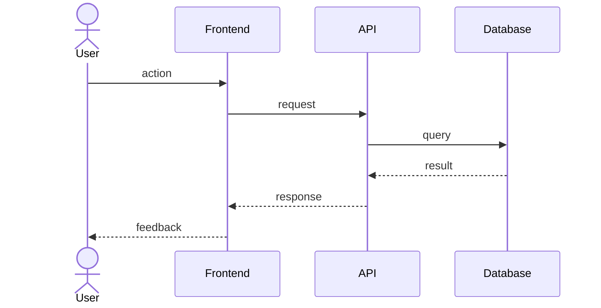

# {{FLOW_NAME}}

<!--
  2-3 sentences: scope of this flow, what triggers it (entry condition),
  what ends it (exit condition), which services it touches. Example:
  "This sequence covers user login via email + password. It starts when
  the SPA POSTs `/auth/login` and ends with an HttpOnly session cookie
  set in the response. It touches the API gateway, the auth-service,
  and the users database."
-->

{{FLOW_DESCRIPTION}}

## Notes

<!--
  Optional: caveats, race conditions, retry logic, observability hooks,
  rate limits. Anything an agent fixing a bug in this flow MUST know
  before touching the code.
-->

{{NOTES}}
